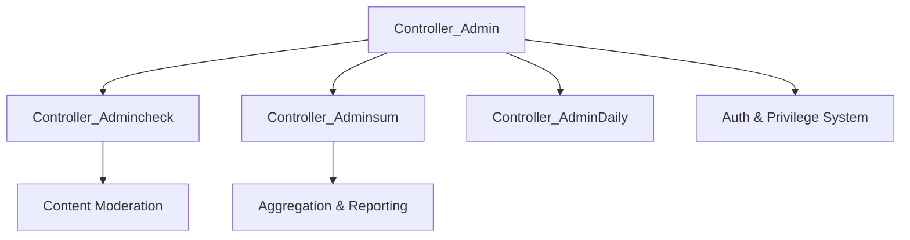

# Admin & Management Portal

# Admin & Management Portal Module

The **Admin & Management Portal** is a centralized control system built on the FuelPHP framework. It provides the infrastructure for administrative oversight, content moderation, statistical aggregation, and system maintenance. It serves as the gatekeeper for administrative access, enforcing granular permissions while logging all sensitive operations.

## Core Architecture

The module follows a hierarchical controller structure where `Controller_Admin` serves as the base class, providing essential lifecycle hooks, security checks, and global view variables.

### Base Controller (`Controller_Admin`)
This is the foundation of all administrative routes. Its primary responsibilities include:
*   **Session & Environment Initialization:** Loads administrative sessions and defines global constants like `VIEW_FOLDER` and `START_PROCESS_TIME`.
*   **Maintenance Mode Enforcement:** Checks the `admin_maintenance` flag. It allows bypasses for specific developer IPs (NB worker IPs) while redirecting others to a maintenance splash page.
*   **Load Average Monitoring:** Executes `loadaverage_chk()` to prevent system instability. If the server load exceeds configured thresholds, administrators are redirected to an alert page to prevent further resource exhaustion.
*   **Template Resolution:** The `get_template()` method handles dynamic pathing for Smarty templates, allowing for content-specific overrides.

## Security & Permissions

The module implements a two-tier authorization system managed via `Model_Admin`.

### 1. Privilege & Permission Checks
*   **Category Level (`check_privilege`):** Validates if an admin has access to a broad functional area (e.g., "Member Management" or "System Settings").
*   **Action Level (`check_permission`):** Validates if an admin can perform a specific action within a category (e.g., "Edit Email" vs. "View Profile").
*   **Superadmin Bypass:** Users assigned to the `superadmin` group bypass all permission checks.

### 2. Audit Logging (`Model_AdminLog`)
Every significant action is recorded in the `admin_logs` table.
*   **Log Types:** Differentiates between `TYPE_VIEW` (accessing data) and `TYPE_OPE` (modifying data).
*   **Place Constants:** Uses a four-digit code system (e.g., `0201` for Member Search) to categorize where an action occurred.
*   **Data Masking:** Includes logic to mask sensitive information like Email addresses and Phone numbers if the viewing administrator lacks specific high-level security roles.

## Content Moderation (`Controller_Admincheck`)

This sub-module handles the manual review of user-generated content. It provides standardized tools for filtering and processing data.

### Key Moderation Features:
*   **NG Word Filtering:** `getNgWordWhere()` generates complex SQL queries to find content containing forbidden words using both standard `LIKE` patterns and `REGEXP`.
*   **Status Management:** Standardizes content states across the platform (Unchecked, Display, Hidden, Web-only).
*   **Automated Intervals:** `action_update_autotime()` allows admins to configure how frequently moderation queues refresh for different content types (Images, Profiles, Messages).

## Statistics & Aggregation (`Controller_Adminsum`)

The aggregation engine provides business intelligence through various search dimensions:
*   **Dimensions:** Supports grouping data by Ad Code, DateTime, Date, Month, and Prefecture.
*   **Dynamic Query Building:** Uses `makeWhereDetail` and `makeWhereDate` to build complex filtering logic for registration and activity reports.
*   **Pager Integration:** Implements `getPagingConfig` to handle large datasets, ensuring search parameters are persisted across paginated results via URL encoding.

## Data Models

### `Model_Admin`
The primary entity representing an administrative user. It links to the core `Model_User` (via the `mgpf` database connection) and manages the relationship with administrative roles and privileges.

### `Model_AdminCheck`
A utility model providing static helper methods for moderation logic. It contains the logic for:
*   **Age Verification:** Constants for image check results (e.g., "ID unclear", "Expired").
*   **SQL Generation:** Shared logic for generating `WHERE` clauses for date ranges and NG word matches used across multiple moderation controllers.

## Implementation Patterns

### Standardized Search Flow
Most administrative search actions follow this execution pattern:
1.  **Condition Gathering:** Collect inputs from `Input::post` or `Input::get`.
2.  **Query Construction:** Pass the query object through `makeWhereDetail` and `makeWhereDate`.
3.  **Pagination:** Calculate totals and initialize the FuelPHP Pagination class.
4.  **Logging:** Record the search parameters and execution time in `Model_AdminLog`.

### Global View Variables
The `before()` method in `Controller_Admincheck` and `Controller_Adminsum` populates the Smarty view engine with standardized lists (Sex, Prefectures, Status codes). This ensures UI consistency across all management screens.