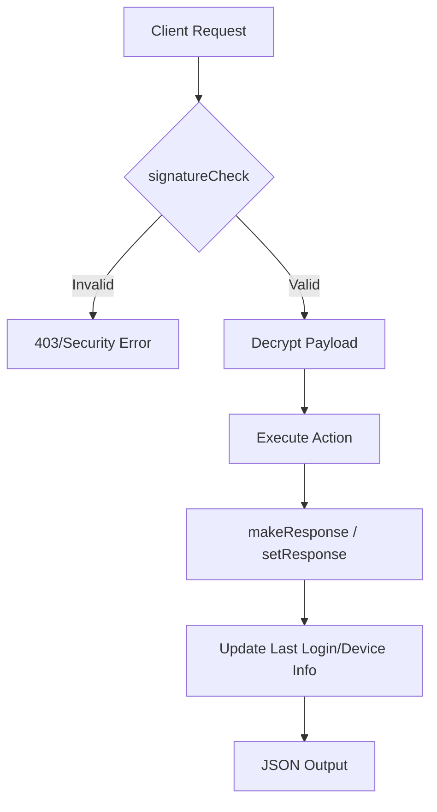

# API Layer

# API Layer Documentation

The API Layer serves as the primary interface between the client applications (Web and Native Mobile) and the system's business logic. It is built on top of the FuelPHP `Controller_Rest` class and provides standardized request handling, security validation, and response formatting.

## Core Controllers

### 1. Controller_Api
The base class for standard RESTful API endpoints, primarily used by the web front-end and general service integrations.

*   **Format**: Defaults to `json`.
*   **Authentication**: Uses a signature-based mechanism (`signatureCheck`) to validate requests.
*   **Session Management**: Validates session cookies for web-based requests via `_isSessionCookie`.
*   **Key Method**: `setResponse($response, $status)` - Standardizes the success status in the JSON payload.

### 2. Controller_Appapi
The specialized base class for Native Mobile Application (iOS/Android) endpoints. It handles complex state synchronization between the app and the server.

*   **Security**: Implements a time-sensitive signature check (`API_TIMEOUT = 180` seconds) and decrypts sensitive fields like `uuid`, `email`, and `password` using `MyEncrypt`.
*   **State Management**: The `makeResponse` method is the central engine for calculating the "App State," including:
    *   Member status (Normal, Pre, Stop, etc.)
    *   Maintenance mode status.
    *   Force update requirements.
    *   Unread message counts and badge data.
    *   Matching alerts and bonus point eligibility.
*   **Version Control**: Handles "Examination Mode" (審査モード) to toggle features or domains during App Store/Google Play reviews.

---

## Request Lifecycle & Security

The API layer enforces a strict validation flow before executing any business logic.



### Signature Validation
For mobile requests, the `sign` parameter is a comma-separated string containing a signature and a timestamp, encrypted.
1.  **Decryption**: The system decrypts the signature.
2.  **Expiration**: If `time() - timestamp > 180`, the request is rejected.
3.  **Field Decryption**: Specific fields (e.g., `birthday`, `uid`) are automatically decrypted if present in the `postdata`.

---

## Key Functional Components

### Member Authentication & Registration (`Controller_App_Api_Mem`)
Handles the lifecycle of a mobile user:
*   **UUID Management**: `action_check_uuid` and `action_set_uuid` link physical devices to member accounts.
*   **Social Integration**: `action_create_fb_member` and `action_link_fb_member` handle Facebook OAuth registration and account linking, including profile picture synchronization.
*   **Profile Management**: `post_set_member_prof` and `post_set_basic` update user attributes while triggering `Model_ProcessLog` entries for auditing.

### Search & Discovery (`Controller_App_Apiv2_Search`)
Provides the data for the app's main discovery interfaces:
*   **Main Feed**: `post_main` calculates the user list based on complex sorting (Recommend, Login, Registration, or Nice Count).
*   **Simple Search**: `action_simpletop` and `post_simple` provide "Easy Search" categories (e.g., "Users nearby", "New members").
*   **Aocca (Matching)**: Manages the "Aocca" specific search mode and purpose-based filtering.

### Response Augmentation (`makeResponse`)
Unlike standard REST controllers that return only the requested resource, `Controller_Appapi::makeResponse` injects global metadata required by the mobile app to function correctly:
*   `is_maintenance`: Boolean flag to trigger the app's maintenance screen.
*   `is_force_update`: Boolean flag to redirect users to the App Store.
*   `bonus`: Information regarding login bonuses or profile completion rewards.
*   `matching`: Real-time alerts if a new match has occurred.

---

## Developer Usage Patterns

### Implementing a New Mobile API Endpoint
When extending `Controller_Appapi`, follow this pattern:

```php
public function action_my_endpoint()
{
    // 1. Security Check
    if (!$this->signatureCheck()) {
        return $this->setResponse([], Consts::API_SUCCESS_SECURITYERR);
    }

    // 2. Business Logic
    $data = Model_Custom::do_work($this->postdata);

    // 3. Return via makeResponse to include App State
    $resmem = Model_Member::getApiResMember($this->sign);
    return Response::forge(json_encode(
        $this->makeResponse(Consts::API_SUCCESS_OK, $resmem, ['payload' => $data])
    ));
}
```

### Debugging
Use the internal `debug()` method. It automatically captures the `ACCESS_URI` and `ACCESS_USERNAME` (if available) and logs the data to the FuelPHP logs.
*   `$this->debug($data, 0)`: Warning (Default)
*   `$this->debug($data, 1)`: Info
*   `$this->debug($data, 3)`: Error

### Maintenance & Versioning
Maintenance mode and Force Updates are controlled via `Model_Extend`. The API layer checks these settings in every `makeResponse` call, allowing for immediate global control over app access without code deployments.