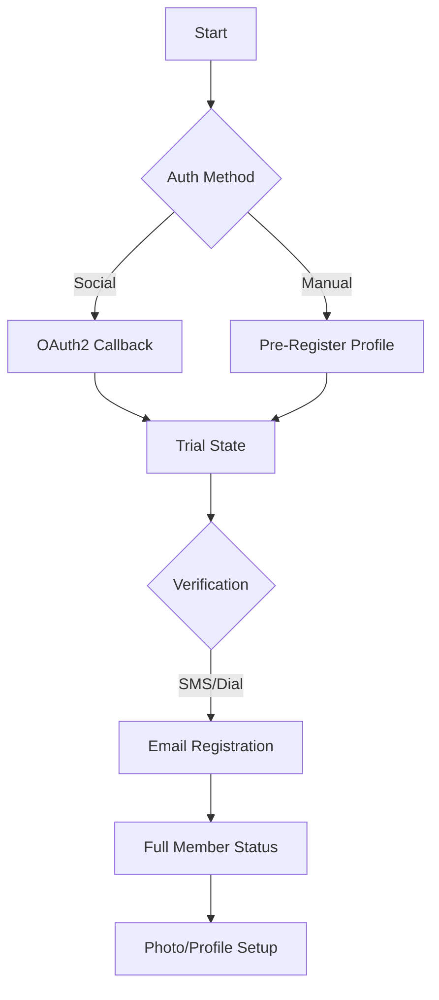

# Authentication & User Management

# Authentication & User Management Module

## Overview
The Authentication & User Management module handles the complete lifecycle of a user, from initial registration and OAuth2 integration to session management, multi-step trial flows, and account status transitions (e.g., withdrawal, pause, and restart).

The system is built on a dual-database architecture:
1.  **MGPF Database (`mgpf`)**: Stores core platform user data in the `users` table.
2.  **Local Database (`default`)**: Stores service-specific member details in the `members` table.

## Core Components

### Controllers
- **`Controller_Auth`**: The base controller for authentication. Handles login/logout, administrative login overrides, and status-based redirection (e.g., showing withdrawal info).
- **`Controller_Auth_Start`**: Manages the "New Flow" for registration using Email or SMS verification codes.
- **`Controller_Auth_Pre`**: Handles the initial "Pre-registration" phase where basic profile data (nickname, gender, birthday) is collected.
- **`Controller_Auth_Trial`**: Manages the "Trial" state, enforcing mandatory verification steps like phone number authentication (SMS or Dial-in) before promoting a user to a full member.
- **`Controller_Oauth2`**: Integrates with Opauth to provide social login/registration (Line, Facebook, Google, etc.).

### Models
- **`Model_User`**: Interfaces with the `mgpf.users` table. Responsible for generating unique usernames and managing platform-level credentials.
- **`Model_Member`**: The primary entity for service-specific logic. It tracks user groups (Pre, Member, Paid, Pause, Draw, Stop), points, and profile status.
- **`Model_AuthCode`**: Handles the generation and transmission of verification codes via Email and SMS.

---

## Registration Lifecycle

The registration process is designed as a multi-stage pipeline to ensure data quality and age compliance.

### 1. Pre-Registration (`Auth_Pre`)
Users provide basic identity data. 
- **Age Gate**: The system strictly enforces a minimum age (30 years) via `_validation()`.
- **Group Transition**: Users are initially created in the `mgpf.users` table and then promoted to the `pre` group in the local `members` table via `wasPromoted2Pre()`.

### 2. Trial Phase (`Auth_Trial`)
Once a "Pre" account exists, the user enters the Trial phase.
- **Mandatory Phone Auth**: Depending on the `ad_code` or system settings, users may be forced to verify a phone number via SMS or by dialing a specific number (`action_register`).
- **Promotion**: Upon successful verification, `wasPromoted2Normal()` is called to transition the user from `pre` to `member`.

### 3. OAuth2 Integration (`Oauth2`)
Social registration bypasses some manual entry but enforces similar checks:
- **Duplicate Check**: `isDuplicateOpenId` ensures a social account isn't linked to multiple local accounts.
- **Data Mapping**: Maps provider data (e.g., Facebook `first_name`) to local fields (e.g., `nickname`).

---

## Authentication Mechanisms

### Standard Login
Handled via `Controller_Auth::action_login`. It checks if a session exists and redirects to the dashboard. It also clears temporary session data for email/phone numbers used during the "Start" flow.

### Verification Code Login (`Auth_Start`)
A modern passwordless flow:
1.  User enters Email or Phone.
2.  `Model_AuthCode::sendAuthCodeMail` or `sendAuthCodeSms` is triggered.
3.  User enters the code in `action_mail_code` or `action_sms_code`.
4.  `action_codelogin` performs a `force_login` using the verified identifier.

### Administrative Login (`action_adminlogin`)
Allows administrators to impersonate users for support purposes.
- **Security**: Requires an encrypted data payload containing a login hash.
- **Logging**: Every admin login is recorded in `Model_ProcessLog` and `Model_AdminLog`.
- **Session**: Sets an `isAdmin` flag in the session to prevent the system from updating the user's "Last Login" timestamp during the session.

---

## User Status Management

The system uses the `group` field to control access and UI:

| Group ID | Status | Behavior |
| :--- | :--- | :--- |
| `pre` | Pre-member | Redirected to Trial/Verification flows. |
| `member` | Normal | Full access to standard features. |
| `paid` | Paid Member | Full access + premium features. |
| `pause` | Paused | Redirected to `action_restart_info`. Can reactivate via `action_restart`. |
| `draw` | Withdrawn | Redirected to `action_withdraw_info`. Access blocked. |
| `stop` | Suspended | Redirected to `action_withdraw_info`. Access blocked. |

### Restarting Membership
Users in the `pause` group can resume activity via `Controller_Auth::action_restart`. This performs a database transaction that:
1.  Updates the `members.group` to `member`.
2.  Updates `users_login_checks.group`.
3.  Clears `pause_at` and `withdrawal_at` timestamps.
4.  Logs the transition in `Model_ProcessLog`.

---

## Developer Notes

### Session Handling
The module relies heavily on the `Session` class for multi-step forms. Key keys include:
- `member`: Array of current member data.
- `login_type`: Distinguishes between `pc`, `sp` (smartphone web), and `app` (native).
- `authcode`: Temporary storage for verified identifiers during the code-login flow.

### Device Detection
The `Agent` helper is used throughout to determine the view folder and layout. Native app users are often redirected to specific "jump" pages (`action_loginjump`, `action_signinjump`) to trigger deep-linking back into the mobile application.

### Security Patterns
- **Validation Callables**: Uses `Helper_MyValidation` for custom rules like `check_valid_email`, `valid_cellphone`, and `ng_word`.
- **Encryption**: Sensitive data passed via URLs or hidden inputs (like admin login data) is processed through `MyEncrypt::decrypt` and `MyEncrypt::encrypt`.