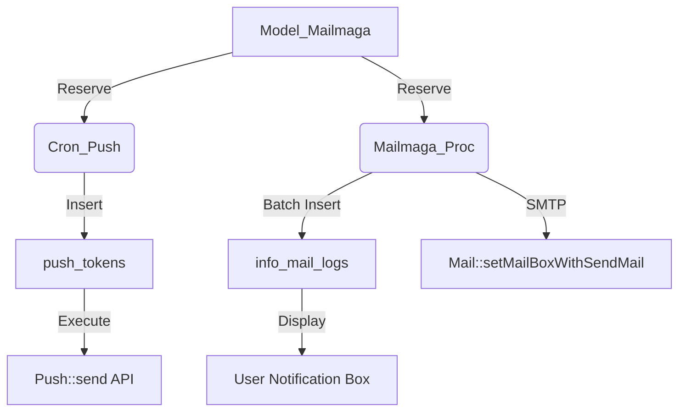

# Batch Tasks & Cron

# Batch Tasks & Cron Module

The **Batch Tasks & Cron** module contains the background processing logic for the application. These tasks handle high-latency operations, data aggregation, and automated maintenance routines that are executed via the FuelPHP `oil refine` command.

## Core Tasks

### 1. Daily Totalization (`Cron_Daily_Totalization`)
Aggregates system-wide metrics for the previous day and persists them into the `daily_totalizations` table.

*   **Metrics Collected:**
    *   User activity (Logins, Registrations, Monthly Active Users).
    *   Financials (Point/Mile usage and acquisition).
    *   Subscriptions (Flat rate and Premium pack counts).
    *   Technical (Device types: iOS, Android, PC, Tablet, SP; and Mail delivery errors).
*   **Logic Flow:**
    1.  Initializes a data matrix for Men, Women, and Total (0).
    2.  Fetches counts from `Model_Dailytotalization` for specific categories.
    3.  Iterates through login data to categorize users by device type and point balance brackets (using `Common::getRealPoint`).
    4.  Saves a record for each gender category for the target date.

### 2. Member Demotion (`Cron_Demote_Member`)
Handles the expiration of paid subscriptions.

*   **Functionality:** Identifies members whose `flat_rate_pack_expire_at` or `premium_expire_at` is earlier than the current timestamp.
*   **Execution:**
    *   Iterates through expired `Model_MemberPayment` records.
    *   Calls `Model_Member::wasDemotedStatus()` to revert the user's status.
    *   Wraps each update in a database transaction to ensure data integrity.

### 3. Withdrawal Cleanup (`Batch_Delete_After_Withdrawal`)
A multi-stage cleanup process for users who have resigned from the service.

*   **Stage 1: Soft Delete (30 Days):** Identifies users in the "draw" (withdrawn) group who resigned more than 30 days ago. It marks them as deleted and obfuscates their email address.
*   **Stage 2: PII Removal:** For users marked as deleted, it:
    *   Nullifies phone numbers in the central `users` table.
    *   Deletes SMS and number logs.
    *   Unlinks all Social Auth providers (Twitter, Facebook, Google, etc.).
    *   **Physical Deletion:** Removes age verification images from S3 using `Common::deleteS3File`.

### 4. Push Notification Dispatch (`Cron_Push`)
Processes scheduled push notifications (Mailmaga) from the `mailmagas` table.

*   **Targeting:** Supports targeting via uploaded files (IDs/Emails) or saved search conditions.
*   **Filtering:** Respects user preferences in `push_alert_settings` and `app_alert_settings`, including:
    *   Global "on/off" toggle for mailmaga.
    *   Day-of-week restrictions.
    *   "Do Not Disturb" time windows (`from_no_receive` / `to_no_receive`).
*   **Queueing:** Inserts pending notifications into the `push_tokens` table before calling the `Push::send()` service.

### 5. Mail Magazine Processing (`Mailmaga_Proc`)
A high-performance task designed to handle bulk email and "In-App Message" (Notification Box) delivery.

*   **Concurrency Control:** Uses System V Semaphores (`sem_get`) and Shared Memory (`shm_attach`) to coordinate multiple processes (up to `MAX_PROC = 3`) and prevent duplicate processing.
*   **Batching:** Processes users in chunks of 500 per process. Database inserts into `info_mail_logs` are batched (1,000 rows or 8MB) to optimize I/O.
*   **Template Engine:** Supports both standard mailmaga content and system templates (via `Model_MailEdit`).

---

## Data Flow: Mailmaga & Push

The following diagram illustrates how a scheduled campaign moves from the database to the end user.



---

## Technical Implementation Details

### Device Detection
The module includes a private utility `_getdevice($user_agent)` used for legacy UA parsing. It categorizes traffic into `ios`, `android`, `tablet`, `sp`, or `pc`. Modern logic in `Cron_Daily_Totalization` has largely shifted to using the `last_device` integer ID stored in the database.

### Transaction Management
Tasks that modify core user status (like `Cron_Demote_Member`) utilize explicit transaction checks:
```php
if (!\DB::in_transaction('default')){
    \DB::start_transaction('default');
    $_begin_trans = true;
}
```
This pattern ensures that the task does not interfere with existing transactions if called internally, while providing safety for standalone execution.

### Command Line Usage
Tasks are executed via the FuelPHP `oil` utility:

```bash
# Run daily totalization
php oil refine cron_daily_totalization

# Run withdrawal cleanup (Dry Run)
php oil refine batch_delete_after_withdrawal dry_run

# Run mailmaga processing (Requires Shared Memory IDs)
php oil refine mailmaga_proc [shm_id] [var_id]
```

## Error Handling
*   **Logging:** Most tasks log start/end times and specific errors to `Fuel\Core\Log`.
*   **Exception Mail:** Critical failures in `Cron_Push` trigger `Common::makeExceptionMailLog`, which alerts administrators via email.
*   **State Management:** `Mailmaga` and `Push` tasks update status columns (`push_state`, `state`) to `ERROR` (5) upon failure to prevent infinite retry loops.