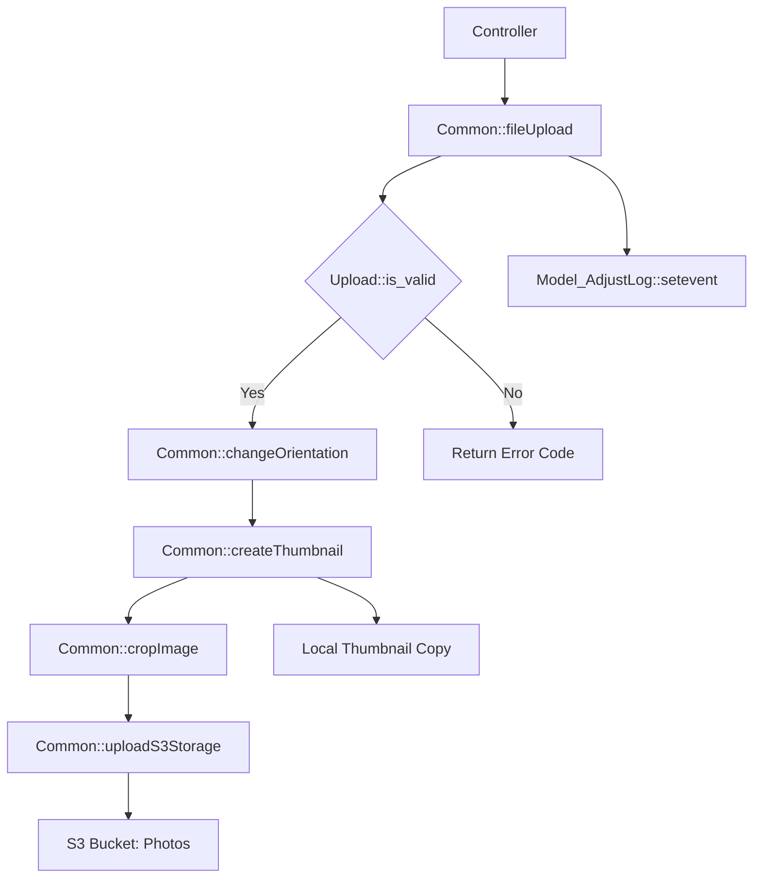

# Core Framework & Utilities — fuel

# Core Framework & Utilities — fuel

The `fuel` module provides the foundational utility layer for the application. It extends the FuelPHP core to handle multi-device detection, complex image processing (local and S3), cryptographic operations, and global application constants.

## Key Components

### 1. Common Utility (`Common` class)
The `Common` class is a centralized hub for business logic utilities that do not belong to a specific model.

*   **Image Processing & Uploads:**
    *   `fileUpload` / `fileUploadMulti`: Handles local file uploads using the FuelPHP `Upload` class. It automatically organizes files into directories (1,000 items per folder) and triggers thumbnail generation.
    *   `createThumbnailByPathAndFileAndType`: A robust engine for generating multiple thumbnail sizes and applying Gaussian blurs for "mosaic" versions of photos.
    *   `cropFromCenterToRatioAndResize`: Ensures images from various mobile devices are normalized to specific aspect ratios and dimensions using GD or Imagick.
    *   `changeOrientation`: Corrects JPEG EXIF orientation issues before storage.
*   **AWS Integration:**
    *   `uploadS3Storage` / `downloadS3Storage`: Interfaces with AWS S3 for persistent storage of profile photos, age verification documents, and static HTML.
    *   `getSigunatureUrl`: Generates CloudFront signed URLs for secure, time-limited access to private S3 assets.
    *   `cfInvalidation`: Triggers CloudFront cache invalidation.
*   **Business Logic:**
    *   `getAge` / `getBirthdayRange`: Logic for age calculation and date-of-birth range filtering.
    *   `getDisplayPoint` / `getRealPoint`: Converts internal system points to user-facing points based on a configurable `pointrate`.
    *   `applySegment`: A template-parsing utility that removes or keeps text blocks based on user attributes (sex, device type) using tags like `[sex1]...[/sex1]`.

### 2. Device & Agent Detection (`Agent` class)
Extends `Fuel\Core\Agent` to provide granular detection of mobile environments, specifically distinguishing between mobile browsers and the native wrapper.

*   **Detection Methods:**
    *   `is_native_app()`: Detects if the request originates from the iOS/Android native app (checks for `angeapp` or `mastersnsapp` in User Agent).
    *   `is_smartphone()` / `is_tablet()`: Distinguishes between small-screen mobile devices and tablets (iPad/Android Tablet).
    *   `get_device_view_type()`: Returns the suffix used for Smarty templates (`pc`, `sp`, `app`, or `mb`).
*   **Template Routing:**
    *   `get_template()`: Implements a hierarchical lookup for view files:
        1.  **Preview:** `views/preview/...` (if `is_preview_mode` is active)
        2.  **Custom:** `views/custom/...` (CMS-uploaded overrides)
        3.  **Default:** `views/default/...` (System standard)

### 3. Global Constants (`Consts` class)
A massive registry of application-wide integers and strings.

*   **Pagination Limits:** Defines standard fetch sizes for search results (`LIMIT_PROFILELIST`), messages, and community members.
*   **API Response Codes:** Standardizes success (`0`) and error states (e.g., `9` for point shortage, `17` for blocked).
*   **Cache Identities:** Defines unique prefixes for Redis/Cache keys (e.g., `CASHID_API_FOOTSTAMP_LIST`).
*   **Member Status:** Maps database integers to logical states like `MEM_STATUS_PREMIUM` or `MEM_STATUS_PAUSE`.

### 4. Cryptography (`MyEncrypt` & `AESMethod`)
Handles data security for sensitive identifiers and external communication.

*   **MyEncrypt:** Uses Blowfish encryption (ECB mode) to obfuscate member IDs in URLs and HTML. It supports `base64_url_safe` encoding to ensure encrypted strings do not break URL routing.
*   **AESMethod:** Provides AES-128-ECB decryption, primarily used for specific secure data exchanges defined in configuration.

---

## Execution Flow: Image Upload & Storage

The following diagram illustrates the flow when a user uploads a profile photo.



---

## Developer Usage Patterns

### Handling Points
Always use the utility methods to ensure point calculations remain consistent if the exchange rate changes in `Model_Param`.
```php
// Displaying points to user
$display = Common::getDisplayPoint($internal_value);

// Converting user input back to system value
$real = Common::getRealPoint($input_value);
```

### Device-Specific Logic
Use the `Agent` class to toggle features or layouts.
```php
if (Agent::is_native_app()) {
    // Logic specific to the iOS/Android WebView wrapper
}

// Load a template automatically suffixed with _pc, _sp, or _app
$view = View::forge(Agent::get_template('profile/index'));
```

### Logging Administrative Actions
When performing sensitive operations in the backend, use `writeLog` to maintain an audit trail.
```php
Common::writeLog([
    'log_type' => '操作',
    'place'    => '会員編集',
    'note'     => '会員ID: 123 のステータスを停止に変更'
]);
```

### Temporary Data Storage
For caching large datasets or session-related settings that shouldn't persist in the main DB, use the Redis-backed `saveTempfile`.
```php
Common::saveTempfile(Consts::CASHID_API_SEARCH_SETTING, $member_id, $search_params);
```