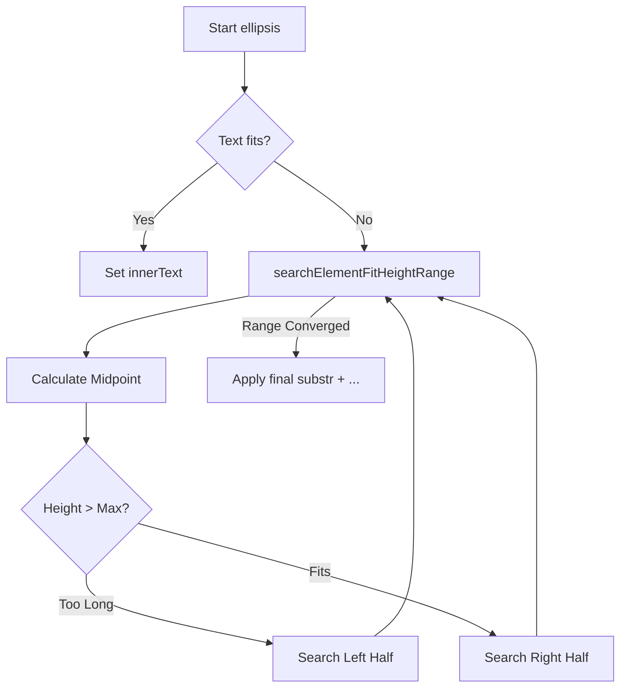

# Core Framework & Utilities — resources

# Core Framework & Utilities — Resources

The `resources` module provides a foundational set of TypeScript utilities for the application. It handles three primary concerns: surrogate-pair aware string manipulation, DOM-based text truncation (ellipsis), and environment detection (User Agent and Browser capabilities).

## String & Text Utilities (`common.ts`)

Standard JavaScript string methods (like `.length` and `.substr`) treat surrogate pairs (emojis, specific symbols) as two separate characters. This module provides replacements to ensure accurate text processing.

### Surrogate-Pair Aware Functions
*   **`count(text: string): number`**: Returns the actual character count of a string, correctly identifying emojis, Fitzpatrick skin type modifiers, regional indicator symbols (flags), and Zero Width Joiners (ZWJ).
*   **`substr(text: string, start: number, length: number): string`**: A surrogate-aware substring implementation. It prevents "breaking" a multi-byte character by checking for variation selectors and surrogate pairs before slicing.

### Formatting & Security
*   **`escapeHtml(text: string)` / `unescapeHtml(text: string)`**: Sanitizes strings for safe injection into the DOM or reverses the process.
*   **`nl2br(text: string)`**: Converts newline characters (`\n`) into HTML ` ` tags.
*   **`format(text: string, ...args: string[])`**: Simple template engine replacing `{0}`, `{1}`, etc., with provided arguments.
*   **`zeroPadding(text: string, length: number)`**: Pads a string with leading zeros.

## UI & Layout Utilities

### Text Truncation (Ellipsis)
The module provides two ways to truncate text that exceeds its container's height.

1.  **`ellipsis(target, text)`**: 
    *   Uses a **binary search algorithm** (`searchElementFitHeightRange`) to find the maximum number of characters that fit within the `offsetHeight` of the target element.
    *   Appends `...` to the result.
    *   Best for single-line or fixed-height containers.
2.  **`ellipsisMultiline(target, text)`**: 
    *   Creates a hidden clone of the element to calculate layout without flickering.
    *   Iteratively removes characters from the end until the clone's height matches the target's original height.
    *   Supports HTML line breaks via `nl2br`.

### Browser & Environment Helpers
*   **`timeout(ms: number)`**: A Promisified `setTimeout` for use with `async/await` patterns.
*   **`isPassedViewTime(accessTime: number)`**: Compares a Unix timestamp against the current time to prevent re-triggering UI events (like toasts) on browser back/forward navigation.
*   **`setHeaderNavi(pagename: string)`**: Manages a comma-separated list of visited pages in a `headerNavi` cookie, used for tracking navigation state.

## Environment Detection

### UserAgentInfo (`user_agent_info.ts`)
A class-based wrapper for parsing `navigator.userAgent`. It provides boolean flags and versioning for specific environments.

| Method | Description |
| :--- | :--- |
| `is_ios()` | Detects iPhone, iPod, or iPad. |
| `is_android()` | Detects Android devices. |
| `get_os_version()` | Returns a 4-digit integer (e.g., `1400` for iOS 14). |
| `is_chrome()` | Detects Chrome, excluding specific wrappers like Yahoo App. |
| `is_ie()` | Detects Internet Explorer (via `msie` or `trident` tokens). |
| `is_facebook()` | Detects if the app is running inside the Facebook in-app browser. |

### Animation & Browser Polyfills (`browser_helper.ts`)
This file executes an IIFE (Immediately Invoked Function Expression) to polyfill `requestAnimationFrame` and `cancelAnimationFrame` for older browsers (IE9, legacy Webkit/Mozilla).

*   **`AnimationBrowserHelper.getIEVersion()`**: Specifically targets IE 10 and older by parsing the `MSIE` token in the User Agent. Returns `null` for modern browsers (Edge/Chrome) or IE 11+.

## Execution Flow: Binary Search Ellipsis

The `ellipsis` function uses a recursive binary search to efficiently calculate text fit, minimizing DOM reflows compared to character-by-character truncation.

## Integration Patterns

*   **Vue.js Integration**: Used in `inserted` hooks (e.g., `community/index.js`) to handle text clamping on dynamic content.
*   **Navigation Tracking**: `setHeaderNavi` is called across various index and list controllers (`tweet/history.ts`, `community/list.ts`) to maintain breadcrumb or navigation state in cookies.
*   **Safety**: `escapeHtml` is utilized during Vue initialization in `tweet/list.ts` to ensure user-generated content is sanitized before rendering.