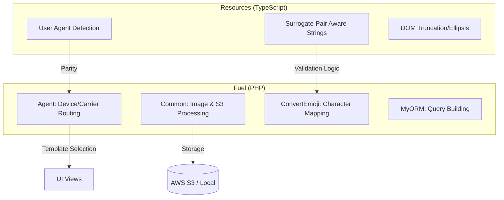

# Core Framework & Utilities

# Core Framework & Utilities

The Core Framework & Utilities module serves as the foundational backbone of the application, bridging server-side PHP logic with client-side TypeScript utilities. It provides a unified interface for device detection, media management, and data integrity across the entire stack.

## Module Overview

This module is divided into two primary sub-modules that synchronize environment handling and data processing:

*   **[Fuel Framework Extensions](fuel.md)**: Extends the FuelPHP core to handle server-side business logic, including multi-device routing, S3-integrated image processing, and cryptographic operations.
*   **[Resources & TypeScript Utilities](resources.md)**: Provides client-side parity for environment detection and advanced string manipulation, specifically focusing on surrogate-pair (emoji) awareness and DOM utilities.

## Integrated Workflows

The sub-modules work together to ensure a consistent user experience and data integrity through the following cross-functional workflows:

### 1. Environment-Aware Rendering
The system uses a dual-layer approach to device detection. The `Agent` class in the **Fuel** module determines the server-side template path (via `get_template` and `get_incfilepath`), while the **Resources** module provides real-time browser and OS detection (e.g., `is_android`) to adjust UI behavior and text truncation logic on the client side.

### 2. Data Integrity & Emoji Handling
To prevent data corruption in databases that may have specific character encoding limits, both modules provide tools for surrogate-pair awareness.
*   **Client-side**: `common.ts` uses `count()` to accurately measure string lengths containing emojis.
*   **Server-side**: `Validation` and `ConvertEmoji` classes use `_getSurrogateCount` and `_convertCodePoints` to sanitize and validate input before persistence.

### 3. Media & Asset Management
The **Fuel** module's `Common` class acts as the primary engine for file lifecycles. It orchestrates local and remote (S3) storage, utilizing automated directory sharding (1,000 items per folder) and triggering thumbnail generation via `createThumbnailByPathAndFileAndType`.

## System Architecture

## Key Cross-Module Components

| Component | Responsibility | Interaction |
| :--- | :--- | :--- |
| **Device Detection** | Identifying OS, Browser, and Carrier. | `Agent.php` (Server) + `common.ts` (Client) |
| **Text Processing** | Handling multi-byte and surrogate characters. | `convertemoji.php` + `resources/common.ts` |
| **File Management** | Uploading, resizing, and deleting assets. | `Common.php` utilizing FuelPHP Upload core. |
| **Data Access** | Fluent interface for database interactions. | `MyORM` extensions for complex query building. |