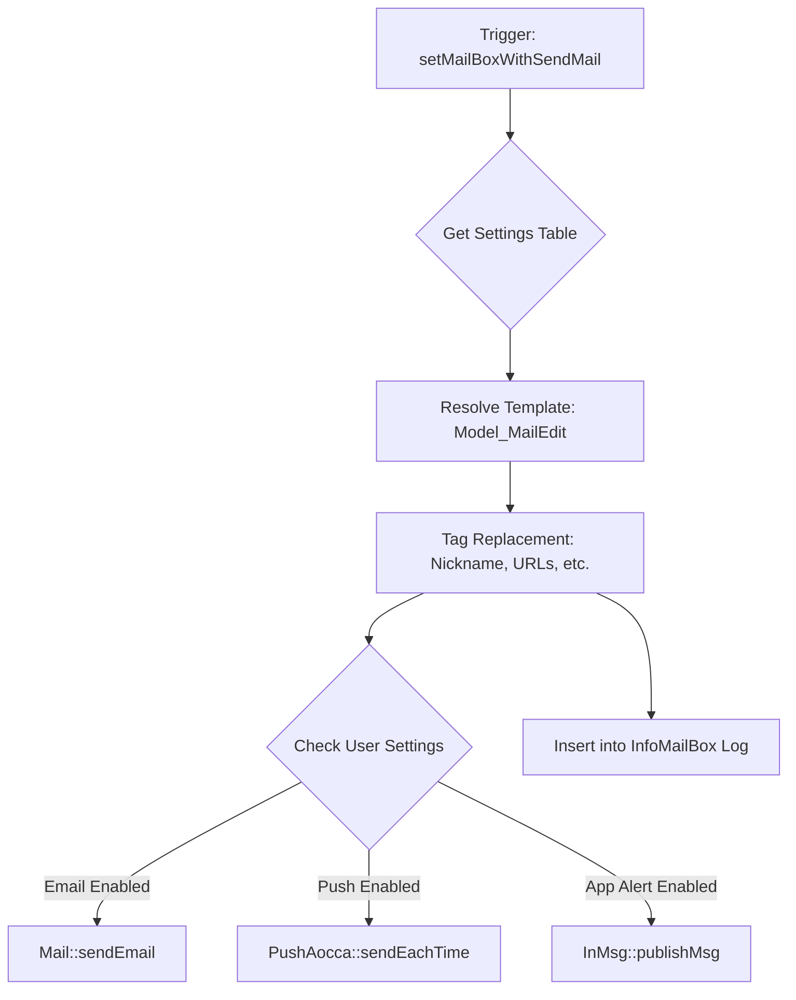

# Email & Notifications

# Email & Notifications Module

The **Email & Notifications** module is a centralized communication engine responsible for delivering transactional emails, system alerts, push notifications, and SMS messages. It integrates template management, user preference filtering, and multi-channel delivery (Email, App Push, and In-App Mailbox).

## Core Components

### 1. Mail Class (`Mail`)
The primary entry point for sending communications. It handles the logic of determining *who* gets *what* message through *which* channel.

- **`setMailBoxWithSendMail()`**: The main dispatcher. It accepts a "Content ID" (e.g., `MAIL_MESSAGE_NOTICE`), resolves the template, checks user notification settings, and triggers delivery across Email, Push, and the internal Mailbox.
- **`getSettingTable()`**: A configuration map that links Content IDs to specific templates, sender addresses, and notification types (Push/App/Email).
- **`sendEmail()` / `sendEmailHtml()`**: Low-level wrappers for the FuelPHP Email driver, handling SMTP headers and mobile-specific formatting (e.g., AU/EZWeb optimizations).

### 2. Push Class (`Push`)
Handles mobile push notifications via Amazon SNS.

- **`send()`**: A batch processing method used by cron jobs to send queued notifications. It uses shared memory (`shm_attach`) and semaphores to manage parallel processing across multiple shell processes.
- **`sendEachTime()`**: Used for real-time notifications. It calculates iOS badge counts dynamically based on the user's unread message/nice/info status.
- **`setErrFlg()`**: Maintenance method that invalidates device tokens when Amazon SNS returns a delivery failure.

### 3. Sms Class (`Sms`)
A specialized class for phone number verification.
- Generates 6-digit verification codes.
- Interfaces with `Model_AuthCode::sendSmsLink` to trigger external SMS gateways.
- Validates codes and updates the member's verified telephone status.

### 4. Model_MailEdit
The template engine for the module. It manages the `mail_edits` table, which stores:
- **Title/Body**: For standard emails.
- **Title/Body Mailbox**: For the internal app notification center.
- **Content Push**: Short-form text for mobile lock screens.

## Notification Flow

The following diagram illustrates how a single call to the module propagates across different channels:



## Template Tag System

Templates in `Model_MailEdit` use a robust tag replacement system to personalize content:

| Tag Category | Examples | Description |
| :--- | :--- | :--- |
| **System URLs** | `_TOPAPP_`, `_MSGLIST_` | Automatically generates deep links for web or app schemes. |
| **User Data** | `_USERNAME_`, `_USERPT_` | Injects recipient's nickname or point balance. |
| **Partner Data** | `_PARTNERNICKNAME_` | Used in action emails (e.g., "X liked your photo"). |
| **Segment Tags** | `[sex1]...[/sex1]` | Conditional content visibility based on gender or device type. |

## Key Constants & Configurations

### Target Channels
- `TARGET_MAIN` (1): Primary email address.
- `TARGET_SUB1/2` (2, 3): Secondary/Mobile addresses.
- `TARGET_ALL` (9): All registered addresses.

### Content IDs
The module distinguishes between three ranges of IDs:
1. **Action Mails (1-99)**: Triggered by user interactions (Likes, Comments, Follows).
2. **System Mails (100-199)**: Triggered by administrative actions (Age verification, Payment confirmation).
3. **Inquiry/Manual (200+)**: Customer support replies and manual newsletters.

## Developer Integration Guide

### Sending a Transactional Notification
To send a notification, identify the appropriate constant in `Mail` and provide the member objects.

```php
// Example: Sending a message notice
Mail::setMailBoxWithSendMail(
    Mail::MAIL_MESSAGE_NOTICE, 
    $sender_member_obj, 
    $recipient_member_id, 
    ['custom_tag' => 'value']
);
```

### Adding a New Notification Type
1. Add a new `const MAIL_NEW_TYPE` in `classes/mail.php`.
2. Define its mapping in `getSettingTable()`, specifying the `template` ID from the `mail_edits` table.
3. If push is required, add the mapping to `Push::$push_type`.
4. Create the corresponding record in the `mail_edits` database table.

### Handling Delivery Failures
The module automatically tracks delivery errors via `insertSendMail()`. If a device token becomes invalid, `Push::setErrFlg()` is called to nullify the `endpoint_arn` in the `device_tokens` table, preventing further wasted API calls to SNS.