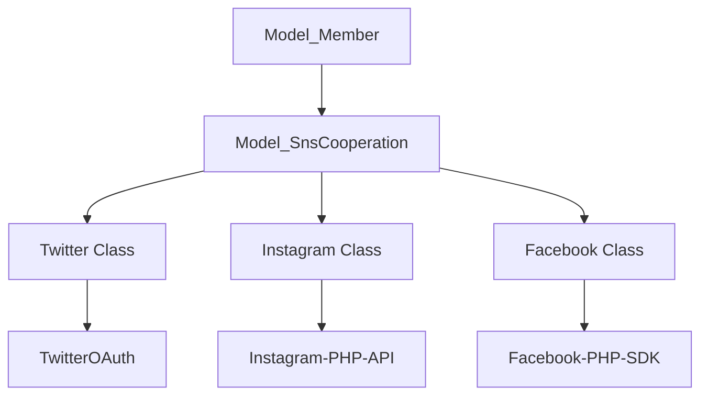

# External Integrations

# External Integrations Module

The External Integrations module provides a unified interface for interacting with third-party platforms, including social media (Apple, Facebook, LINE, Instagram, Twitter), mobile marketing (Adjust), push notifications (Amazon SNS), and affiliate networks.

## Core Components

### 1. Authentication & Identity Providers

#### Apple API (`AppleApi`)
Handles "Sign in with Apple" server-side validation and token management.
- **JWT Generation**: Uses `generateJWT` to create client secrets signed with ES256 using private keys stored in the application path.
- **Token Management**: `get_acess_token` exchanges authorization codes for access tokens.
- **Revocation**: `apple_revoke` allows the application to invalidate refresh tokens when a user withdraws from the service.

#### LINE (`Line`)
Manages LINE Login and profile synchronization.
- **Verification**: `verifyAccessToken` and `verifyIdToken` validate tokens against LINE's OAuth2 servers.
- **Profile Sync**: `getUserinfo` retrieves user metadata, and `saveProfilePicture` downloads and stores the user's LINE avatar locally.

#### Facebook (`Facebook2` & `Facebook`)
The system maintains two Facebook implementations:
- `Facebook2`: A utility class for fetching user data (friends, albums, photos) and saving profile pictures using the Facebook PHP SDK.
- `Facebook` (Model Extension): Integrated with the `SnsCooperation` system for long-term account linking and automated feed synchronization.

### 2. SNS Cooperation System
The `Model_SnsCooperation` base class and its children (`Twitter`, `Instagram`, `Facebook`) manage persistent links between local member accounts and external social profiles.



- **Real-time Sync**: `Instagram::createPhotoAndTweet` handles incoming webhooks to automatically import Instagram posts as local "Tweets."
- **Batch Processing**: `getTargetPeriodFeedAndTweet` (Facebook) and `getMyTimeLine` (Twitter) support "Matome" (summary) features, typically triggered by cron tasks to aggregate social activity.
- **Media Handling**: Classes include private `_createPhoto` methods to download remote images, generate thumbnails via `Common::createThumbnail`, and register them in `Model_Photo`.

### 3. Mobile Push Notifications (`Sns`)
Wraps the AWS SDK to manage mobile push notifications via Amazon SNS (FCM v1).

- **Endpoint Management**: `getEndpointArn` registers device tokens with AWS; `deleteEndpointArn` removes them.
- **High-Volume Dispatch**: 
    - Single recipients use `sendToEndpoint`.
    - Multiple recipients use `sendToTopic`, which dynamically creates a temporary SNS Topic, subscribes users in parallel (using `CommandPool`), publishes the message, and then cleans up the topic.
- **Payload Construction**: `buildMessage` formats data for both iOS (APNS) and Android (FCM), including custom metadata like badge counts and deep-link targets.

### 4. Marketing & Attribution

#### Adjust Integration (`Model_AdjustLog`)
Tracks user lifecycle events for mobile attribution.
- **Event Tracking**: `setevent` records significant actions (registration, age verification, purchases). It enforces "one-time" logic for specific events like `REGISTER_MALE_ETOKEN`.
- **Callback Handling**: `updatebycallback` processes incoming pings from Adjust to link internal `members_id` with Adjust's `adid` and `tracker` information.
- **App Synchronization**: `getEventToken` retrieves pending events to be sent to the mobile client for client-side tracking.

#### Affiliate System (`Affiliate`)
Manages conversion reporting for multiple affiliate networks (A8, AffiliateB, Rentracks, AccessTrade).
- **Conversion Logic**: `send($members_id)` identifies the affiliate type from the member's profile and dispatches a GET request to the respective provider's tracking URL.
- **Error Logging**: Failed pings are recorded in `Model_FailedAffiliateLog` via the `connect` method for manual reconciliation.

## Configuration
Most classes depend on specific configuration files located in `fuel/app/config/`:
- `apple_login.php`: Team IDs, Key IDs, and `.p8` file paths.
- `opauth.php`: API keys and secrets for Facebook, Twitter, and LINE.
- `aws_sns.php`: Platform Application ARNs.
- `adjust.php`: Event tokens mapped by OS.

## Usage Patterns

### Social Media Posting
To post a message to a user's linked Twitter account:
```php
$twitter = new Twitter(['members_id' => $user_id]);
if ($twitter->isCooperation()) {
    $twitter->post("Hello from the app!", $optional_photo_id);
}
```

### Triggering Attribution
To record a successful purchase for Adjust:
```php
Model_AdjustLog::setevent($user_id, Model_AdjustLog::POINT_ETOKEN, $price, $order_id);
```

### Sending Push Notifications
```php
Sns::send([
    'endpoint_arn_array' => [$arn],
    'alert' => 'You have a new message!',
    'badge' => 1,
    'to' => 'messages/view'
]);
```