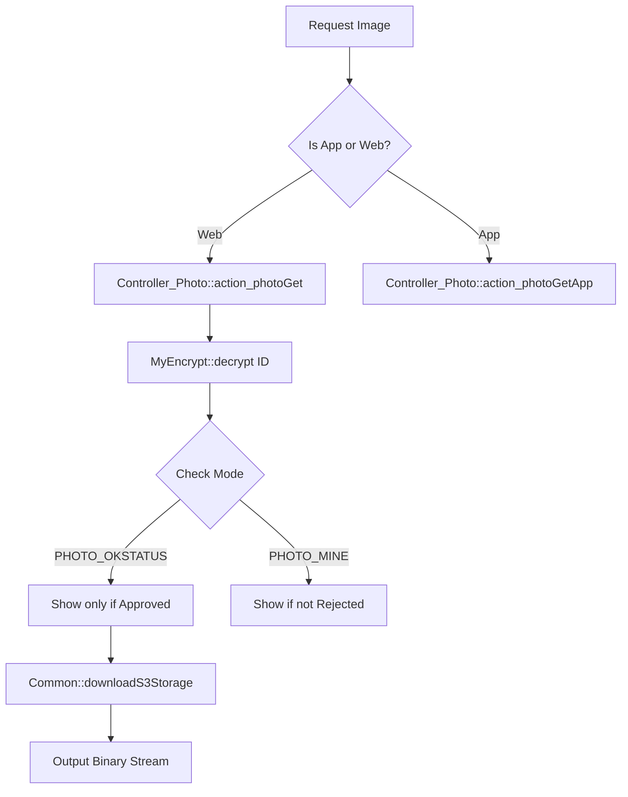

# Media Handling

# Media Handling Module

The Media Handling module manages the lifecycle of user-generated visual content, including photos and videos. It handles secure storage (S3 and local), administrative review workflows, content privacy, and dynamic image processing (thumbnails and watermarking/mosaics).

## Core Components

### 1. Photo Management (`Controller_Photo` & `Model_Photo`)
The photo system distinguishes between several content types defined in `Model_Photo`:
*   `CONTENT_PROFILE`: Primary user profile pictures.
*   `CONTENT_SUB`: "Appeal" or gallery photos.
*   `CONTENT_MESSAGE`: Photos attached to private messages.
*   `CONTENT_TWEET`: Photos used in social feed posts.

#### Privacy and Visibility
Visibility is determined by a combination of the `check` status (administrative approval) and `album_flg`.
*   **Check Statuses**: `CHECK_OFF` (Pending), `CHECK_ON` (Approved), `CHECK_NG` (Rejected).
*   **Rollback Logic**: When a new photo is uploaded, the system uses `setPhotoRollback` to manage versioning. If a new photo is pending or rejected, the system can automatically revert to displaying the last "Approved" photo for that user.

### 2. Video Management (`Controller_Video`, `Model_Video`, & `Video`)
Videos undergo an asynchronous conversion process to ensure cross-device compatibility.
*   **Upload**: Files are initially stored in a temporary directory.
*   **Conversion**: The `Video::convert()` method interfaces with the **CloudConvert API** to transcode various formats into optimized MP4s and generate PNG thumbnails.
*   **Streaming**: `Video::play()` implements partial content streaming (`HTTP 206`) to allow seeking within the video player.

---

## Key Workflows

### Image Retrieval Flow
Images are rarely accessed directly via static URLs. Instead, they are served through controller actions that verify permissions and encryption.

### Administrative Review (`setProfileimagecheck`)
When an administrator approves or rejects media, the following side effects occur:
1.  **Point Allocation**: Users may receive bonus points for their first approved profile or appeal photo (`Model_BonusPoint`).
2.  **Penalty Tracking**: Rejections (`CHECK_NG`) increment the user's `ng_cnt` in `member_details`.
3.  **Notifications**: Automated emails are dispatched via `Mail::setMailBoxWithSendMail` based on the result.
4.  **Log Generation**: Entries are created in `Model_ProcessLog` and `Model_AdminLog`.

---

## Technical Reference

### Encryption and Security
Most media IDs passed in URLs are encrypted using `MyEncrypt::encrypt()`. Controllers like `Controller_Photo` decrypt these IDs before querying the database to prevent ID enumeration attacks.

### S3 Integration
The module uses `Common::downloadS3Storage` to fetch assets. 
*   **Photos**: Stored in `Consts::S3BUCKET_PHOTOS`.
*   **Age Verification**: Stored in `Consts::S3BUCKET_AGE` with stricter referrer checks in `action_ageverifyGet`.

### Thumbnail Conventions
The system generates and expects specific suffixes for different UI requirements:
*   `_thumbnail1.jpg`: Small square (List views).
*   `_thumbnail2.jpg`: Medium (Profile view).
*   `_thumbnail3.jpg`: Large (Expanded view).
*   `_mosaic1.jpg` / `_mosaic2.jpg`: Blurred versions for restricted content.

### Video Conversion States
| Status | Constant | Description |
| :--- | :--- | :--- |
| 0 | `STATUS_OFF` | Uploaded, waiting for cron to pick up. |
| 1 | `STATUS_EXE` | Currently being processed by CloudConvert. |
| 2 | `STATUS_ON` | Conversion successful; available for playback. |
| 3 | `STATUS_NG` | Conversion failed. |

## Developer Notes
*   **Performance**: The `before()` method in `Controller_Photo` skips standard front-end initialization for image-get actions to reduce CPU overhead.
*   **Transaction Safety**: Media status updates, especially those involving point transfers or log entries, are wrapped in `DB::start_transaction()`.
*   **Physical Deletion**: The `deleteContent($path)` method handles the removal of the base image and all associated thumbnails/mosaics from the local filesystem.