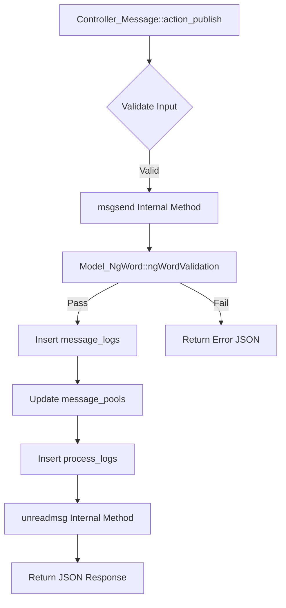

# Messaging & Communication — fuel

# Messaging & Communication — Fuel Module

The Messaging & Communication module handles all direct interactions between users, including private messaging, matching notifications, system announcements, and inquiry management. It serves as the core engine for user engagement within the SNS platform.

## Core Components

### 1. Controllers
*   **`Controller_Message`**: The primary interface for 1-on-1 chat. It manages message history, real-time message polling (via JSON), and message transmission.
*   **`Controller_Msglist`**: Manages the "Inbox" or "Matching List" views. It handles the high-level categorization of conversations (Matching vs. General Messages) and sorting logic.
*   **`Controller_Mailbox`**: Handles non-user-to-user communication, specifically system notifications (`infomail`), site news, and support ticket replies (`inquiry`).

### 2. Models
*   **`Model_MessageLog`**: The data layer for individual message records. It includes complex logic for "1st Approach" (initial messages), read status tracking, and administrative moderation (NG word filtering).
*   **`Model_MessagePool`**: Manages the "Room" or "Conversation" state. It aggregates message data to provide a summary view for the message list, handling caching and pagination for performance.

---

## Message Flow Architecture

The following diagram illustrates the execution flow when a user sends a message through `action_publish`.

---

## Key Functional Areas

### 1. The 1-on-1 Chat Interface (`Controller_Message`)
The chat system supports several specialized message types and states:
*   **Penalty Checks**: Before loading a chat, `Tag::isMemberPenalty` is checked to restrict access for penalized users.
*   **1st Approach Logic**: The system distinguishes between the first message sent and subsequent replies. `Model_MessageLog::checkFirstApp` tracks if a message is under administrative review.
*   **Message Types (`place`)**:
    *   `PLACE_MESSAGE` (0): Standard chat.
    *   `PLACE_QUESTION` (1) / `PLACE_ANSWER` (2): Specific Q&A interactions.
    *   `PLACE_NICE` (5): Messages attached to "Likes".
*   **Polling & Updates**: `action_prepend` and `action_tickread` provide the backend for AJAX-based message updates, allowing the UI to fetch new messages without a full page reload.

### 2. Inbox Management (`Controller_Msglist`)
The inbox categorizes interactions into two main tabs:
*   **Matching**: Users who have mutually liked each other.
*   **Messages**: Active conversation threads.

It utilizes `Model_MessagePool::getNicesMatchingLists` to fetch a combined view of users and their latest message snippets. The list state (sort order, active tab) is persisted via `Common::saveTempfile` to maintain user context across sessions.

### 3. System & Support Communication (`Controller_Mailbox`)
This controller manages the "Information" section of the app:
*   **Infomail**: Automated notifications (e.g., "Someone liked your photo").
*   **News**: Global site announcements.
*   **Inquiry**: A threaded support system where users can view their sent inquiries and staff replies.

---

## Security & Moderation

### Encryption
The module heavily relies on `MyEncrypt` to obfuscate internal IDs in URLs and JSON payloads.
*   `message_key`: Usually a comma-separated string of `(my_id, partner_id)` encrypted to prevent ID enumeration.
*   `api_partner_id`: Encrypted version of the recipient's ID used for API calls.

### Content Filtering
All outgoing messages pass through `Model_NgWord::ngWordValidation`. 
*   If a message contains prohibited terms, it is either blocked or automatically replaced with asterisks via `setGuardWordReplaceAsterisk`.
*   Administrative status (`CHECK_NG`, `CHECK_FNG`) allows moderators to hide messages from the UI while retaining them in the database.

### Access Control
The module enforces strict visibility rules:
*   **Blocking**: `Model_Block::isMeBlocked` and `isPartnerBlocked` prevent message delivery and UI rendering if a block relationship exists.
*   **Age Verification**: Many features (like sending custom templates or viewing certain photos) are gated behind `member->isAdult()` and `member->age_check`.

---

## Implementation Details

### Message Sending (`msgsend`)
The `msgsend` method in `Controller_Message` is a multi-step transaction:
1.  Verifies that neither user has blocked the other.
2.  Validates the message body against NG words.
3.  Determines the `place` (context) of the message.
4.  Inserts into `message_logs`.
5.  Updates the `updated_at` timestamp in `message_pools` to "bump" the conversation to the top of the inbox.
6.  Logs the action in `process_logs` for auditing.

### Read Status Tracking
Read status is updated via `Model_MessageLog::setReadat`. To optimize performance, it performs a bulk update on unread messages from a specific partner when the user opens the chat room, excluding messages that are still pending image moderation.