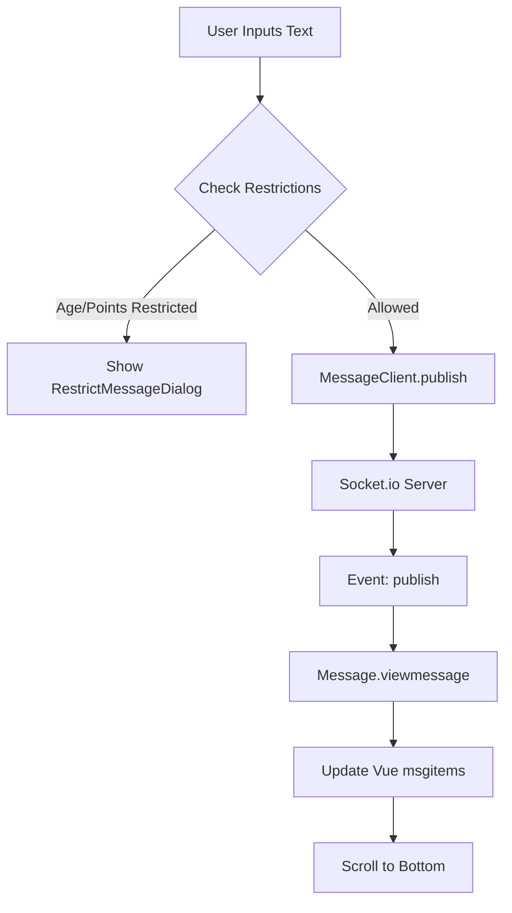

# Messaging & Communication — resources

# Messaging & Communication — Resources

The Messaging module provides a real-time chat interface using Socket.io and Vue.js. It handles bidirectional communication, message history, read receipts, image uploads, and complex business logic regarding user age verification and point-based feature access.

## Core Components

### 1. MessageClient (`socketclient.ts`)
A wrapper around `socket.io-client` that manages the WebSocket connection and provides an Observable-based interface for event handling.

*   **Connection Management**: Handles initial connection, manual reconnection, and listener cleanup.
*   **Event Emission**: Provides typed methods for specific socket actions:
    *   `connect(connectkey)`: Authenticates the session.
    *   `publish(senddata)`: Sends a standard text message.
    *   `publishTemplate(...)`: Sends a message using a predefined template.
    *   `publishimg(senddata)`: Sends an image message (after upload).
    *   `readMessage(senddata)`: Notifies the server that a specific message has been viewed.
    *   `prepend(senddata)`: Requests historical messages (pagination).
*   **Reactive Listening**: The `on(socketEvent)` method returns an RxJS `Observable`, allowing the main application to subscribe to incoming data streams (e.g., `putmsg`, `publish`, `chgread`).

### 2. Message Controller (`index.ts`)
The central orchestrator that initializes the UI, manages state, and bridges the Socket client with the Vue components.

*   **State Tracking**: Manages message IDs for pagination (`gstartmsgid`, `lastmsgid`), read status arrays (`markMsgIdRead`), and partner status (blocked, hidden, or retired).
*   **Socket Integration**: Subscribes to `MessageClient` events within the `setOn()` method to update the UI in real-time when messages are received or read statuses change.
*   **Business Logic**: Enforces restrictions based on `age_check` status and point balances.

## Execution Flow: Message Lifecycle

## Key UI Sub-Modules (Vue Instances)

The module divides the chat interface into several specialized Vue instances:

| Instance | Responsibility |
| :--- | :--- |
| `headerVue` | Displays partner info, online status, and the "Read Receipt" toggle. |
| `messageVue` | Manages the message list, iScroll integration, and message rendering (text vs. image vs. system alerts). |
| `footerVue` | Handles the input area, auto-expanding textareas, and file upload triggers. |
| `messagePreviewDialog` | Full-screen image viewer that fetches high-res CloudFront URLs via API. |
| `errorDialog` | Centralized error reporting for socket failures or business logic rejections. |

## Feature Implementation Details

### Read Receipts
The system tracks read status through a combination of socket events and DOM manipulation:
1.  When a message enters the viewport and meets criteria (not a system message, partner is authorized), `io.readMessage()` is emitted.
2.  The server broadcasts `chgread`.
3.  `insertMessageStatus(msgid)` is called, which uses `waitForElementToDisplay` to ensure the DOM is ready before injecting the "Read" (既読) or "Unread" (未読) labels.

### Image Uploads
Images are not sent directly via Sockets. 
1.  `fileUpload(file)` sends a `multipart/form-data` POST request to `/quick/photoupload.json`.
2.  Upon success, the resulting `photosid` is passed to `io.publishimg()`.
3.  The socket server then broadcasts the message to both participants to render the image bubble.

### Pagination (Infinite Scroll)
The module uses `iscroll-probe` and `vue-iscroll-view`. 
*   **Pull-down**: Triggers `io.prepend` with the `firstmsgid` to fetch older messages.
*   **Pull-up**: Triggers `io.prepend` with the `lastmsgid` to fetch newer messages (used primarily during reconnection).

### Security & Restrictions
*   **Age Verification**: If `jsObject.age_check` is "0", most interactions (focusing input, clicking templates) are intercepted to show the `AgeCheckDialog`.
*   **Browser "Back" Navigation**: The `handleSendButtonClick` function includes a specific check for users returning to the page via browser history. It verifies the partner's block/hide status via API before allowing a message to be sent, preventing "zombie" interactions.

## Dependencies
*   **Socket.io-client**: Real-time transport.
*   **RxJS**: Event stream management.
*   **Vue.js (v2)**: UI framework.
*   **iScroll**: Smooth scrolling and pull-to-refresh on mobile.
*   **Axios**: HTTP client for uploads and status checks.
*   **StoreJS**: Local storage management for message persistence across reloads.