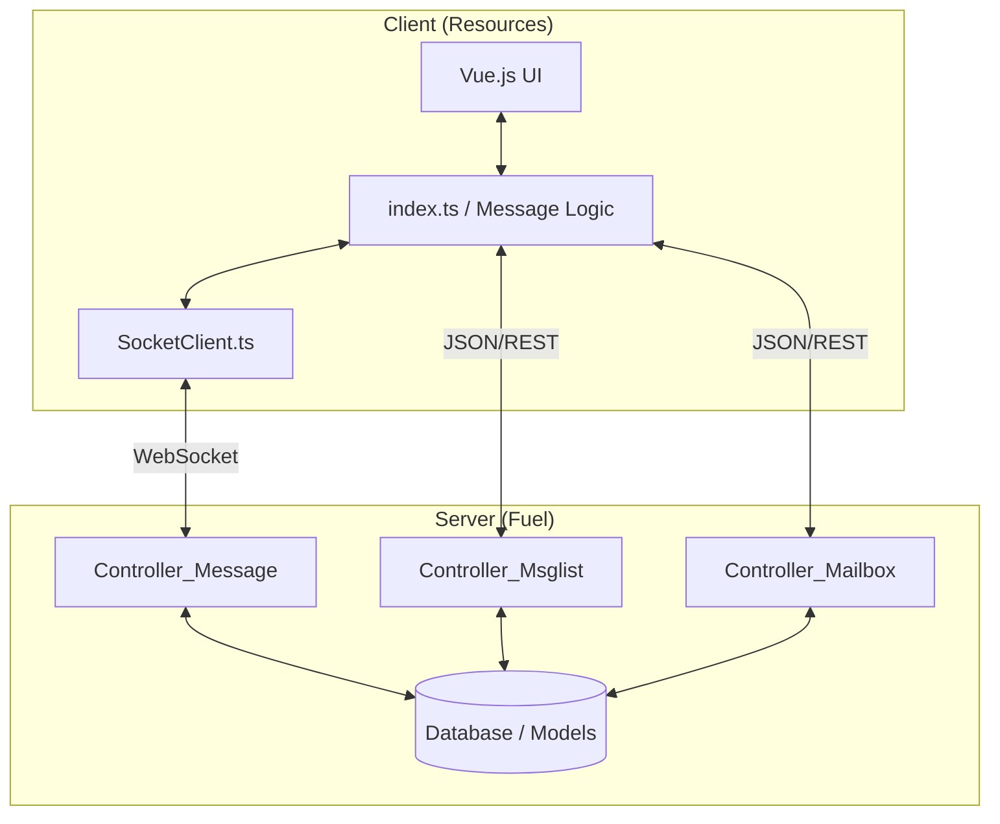

# Messaging & Communication

# Messaging & Communication Module

The Messaging & Communication module is a hybrid communication engine that facilitates real-time user engagement, administrative inquiries, and system-wide notifications. It bridges server-side PHP logic (FuelPHP) with a reactive frontend (Vue.js/Socket.io) to provide a seamless chat experience.

## Module Architecture

The module is split into two primary layers:
*   **[Fuel (Server-side)](fuel.md)**: Manages the business logic, database persistence (MessagePool, MessageLog), session-based authentication, and point-based feature gating.
*   **[Resources (Client-side)](resources.md)**: Handles the real-time transport layer via WebSockets, UI state management, and interactive components like image uploads and template selection.

## Key Workflows

### Real-Time Chat & Synchronization
The core chat flow utilizes `Controller_Message` to initialize sessions and `MessageClient` (Socket.io) for bidirectional delivery. 
1.  **Initialization**: `index.ts` initializes the `MessageClient` and authenticates using a `connectkey`.
2.  **Transmission**: When a user sends a message, `handleSendButtonClick` triggers an emission through the socket.
3.  **Persistence**: The server-side `action_publish` updates the `messagelog` and `messagepool` models to ensure history is preserved.
4.  **State Updates**: Real-time events update read receipts and message status indicators via `insertMessageStatus`.

### Conversation Management
The `Controller_Msglist` organizes interactions into distinct categories:
*   **Matching Lists**: High-priority conversations derived from mutual user interest.
*   **General Inbox**: Standard 1-on-1 messaging.
*   **Favorites**: Managed via `setFavorite` in the frontend to filter the message list view.

### System & Support Communication
Non-peer-to-peer communication is routed through `Controller_Mailbox`. This handles:
*   **Inquiry Timelines**: Direct support tickets between users and administrators.
*   **Info Mail**: System-generated announcements and notifications.

### Monetization & Verification
The module integrates with the platform's economy and safety features:
*   **Point Access**: Functions like `checkPoinsAndBuyFuncRead` verify if a user has sufficient balance to access premium features (e.g., read receipts).
*   **Age Verification**: Logic within the message controllers restricts communication capabilities based on the user's verification status.