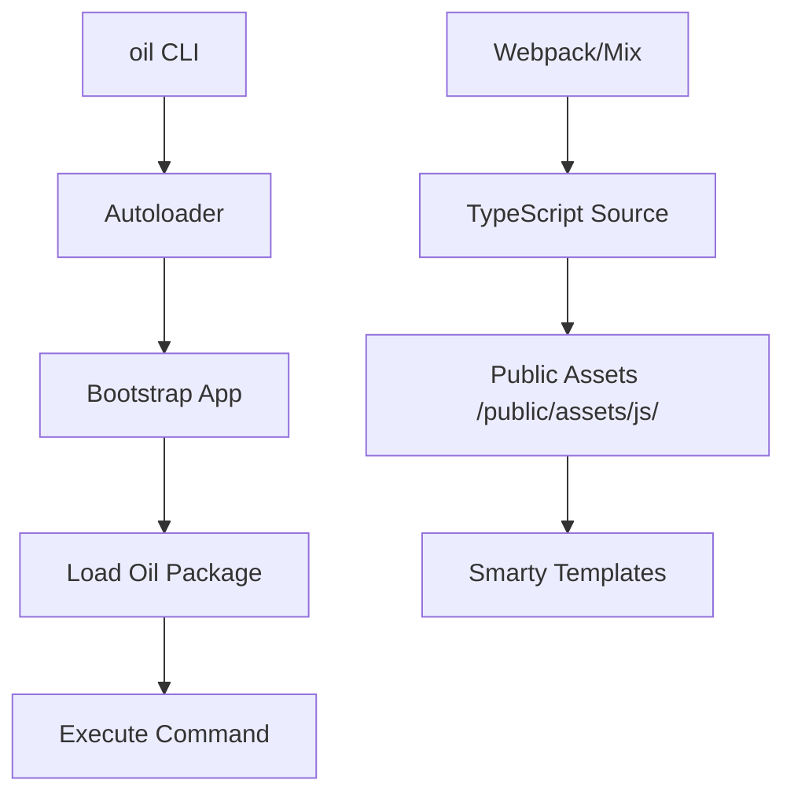

# Other — ange_mastersns

# ange_mastersns Module Documentation

The `ange_mastersns` module serves as the core application layer for the "Aocca" social networking service. It is built on the **FuelPHP 1.8** framework and utilizes a modern frontend stack consisting of **TypeScript**, **Vue.js**, and **Laravel Mix** (Webpack).

## System Architecture

The module follows a traditional MVC pattern on the backend, supplemented by a component-based architecture on the frontend.

### Backend: FuelPHP
The backend handles business logic, database interactions (via Fuel ORM), and server-side rendering using Smarty templates.
- **Core Framework:** FuelPHP 1.8 (Master branch).
- **Template Engine:** Smarty 3.1.40.
- **CLI Tooling:** The `oil` executable is used for migrations, scaffolding, and package management.

### Frontend: TypeScript & Vue.js
The frontend is highly modularized, with TypeScript files compiled into specific public assets.
- **State Management/UI:** Vue.js 2.6 with Class Components and Property Decorators.
- **Build System:** Laravel Mix (Webpack wrapper) manages the compilation of TypeScript (`.ts`) and HTML assets.
- **Real-time Features:** Integration with `socket.io-client` for messaging and notifications.

---

## Key Components & Directory Structure

### 1. Configuration & Dependencies
*   **`composer.json`**: Defines the PHP environment. Key integrations include AWS SDK, Google API Client, Amazon Pay, and Opauth for social logins (Facebook, Twitter, Google, YahooJP).
*   **`package.json`**: Manages Node.js dependencies. Includes `axios` for API requests, `rxjs` for reactive programming, and `animejs` for animations.
*   **`appspec.yml`**: AWS CodeDeploy configuration, defining file permissions and post-install hooks (e.g., clearing Smarty template caches).

### 2. Frontend Asset Pipeline (`webpack.mix.js`)
The build process is granular. Instead of a single bundle, the system generates specific scripts for different application domains:
- **Common:** `common.ts`, `dialog.ts`, `toast.ts`.
- **Auth:** Login, registration, SMS/Mail verification logic.
- **Profile:** Separate modules for editing, searching, and detail views.
- **Social:** Community management, tweeting, and messaging (Socket.io).

### 3. Core Execution Flow
The application entry point for CLI operations is the `oil` script.



---

## Development Workflow

### Prerequisites
- PHP 7.4 or higher.
- Node.js and NPM.
- Composer.

### Installation
1. Install PHP dependencies:
   ```bash
   composer install
   ```
2. Install JavaScript dependencies:
   ```bash
   npm install
   ```

### Building Assets
The module uses `laravel-mix` for asset compilation.
- **Development:** `npm run dev` (Generates source maps).
- **Production:** `npm run pro` (Minifies code using `UglifyJsPlugin` and optimizes memory for large builds).

### Deployment
Deployment is handled via AWS CodeDeploy as defined in `appspec.yml`. 
- Files are moved to `/domain/aocca`.
- Permissions are set to `webadm:apache`.
- The script `fuel/shell/rm_templates_c.sh` is triggered after installation to ensure no stale compiled templates remain.

---

## Technical Specifications

| Feature | Implementation |
| :--- | :--- |
| **Language** | PHP 7.4+, TypeScript 2.9+ |
| **Frontend Framework** | Vue.js 2.x (Class-style) |
| **Styling** | Handled via Laravel Mix (SASS/CSS) |
| **Real-time** | Socket.io |
| **Social Auth** | Opauth (Facebook, Twitter, Google, Yahoo) |
| **Storage/Cloud** | AWS SDK (S3/etc.), CloudConvert |
| **Payments** | Amazon Pay API SDK |

## Notes for Contributors
- **Type Safety:** All new frontend logic should be written in TypeScript. Refer to `tsconfig.json` for compiler options (ES5 target, ES2015 modules).
- **Linting:** Run `tslint` before committing to ensure compliance with the project's `tslint.json` rules (e.g., no-console is disabled, but trailing commas are restricted).
- **Template Caching:** If UI changes are not appearing, manually run the `rm_templates_c.sh` script or clear the `fuel/app/cache` directory.