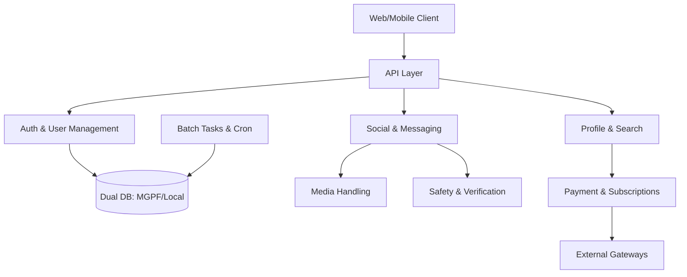

# mastersns-driver — Wiki

# Welcome to the MasterSNS Driver Wiki

MasterSNS Driver is a robust social networking service backend and frontend framework. It is designed to handle high-concurrency social interactions, secure identity verification, and complex financial transactions. The system leverages a hybrid architecture, combining the stability of **FuelPHP 1.8** for server-side logic with the reactivity of **Vue.js and TypeScript** for the user interface.

## System Architecture

The platform is built on a modular foundation where the [API Layer](api-layer.md) acts as the primary gateway for both web and native mobile clients. Business logic is distributed across specialized modules that interact through a centralized [Core Framework](core-framework-utilities.md).

## Core Functional Areas

### User Lifecycle & Security
The journey begins with [Authentication & User Management](authentication-user-management.md), which utilizes a dual-database strategy to sync core platform data with local service details. To ensure platform integrity, the [Safety & Verification](safety-verification.md) module manages age validation and content moderation, while [Media Handling](media-handling.md) processes user uploads with automated watermarking and administrative review workflows.

### Engagement & Communication
Users interact through [Social Features](social-features-aocca-community.md), which include interest-based communities and real-time "Aocca" meeting statuses. These interactions are supported by a robust [Messaging & Communication](messaging-communication.md) engine that facilitates real-time chat via Socket.io and a centralized [Email & Notifications](email-notifications.md) system for out-of-app engagement.

### Monetization & Discovery
The [Profile & Search](profile-search.md) module allows users to discover others through complex filtering. Access to premium features is governed by the [Payment & Subscriptions](payment-subscriptions.md) module, which integrates with multiple external gateways (Credit Card, Amazon Pay, etc.) to manage point consumption and flat-rate plans.

### Administration & Maintenance
System health is maintained by [Batch Tasks & Cron](batch-tasks-cron.md), which handles daily data totalization and high-latency background jobs. Internal oversight is provided by the [Admin & Management Portal](admin-management-portal.md), offering tools for moderation, analytics, and granular permission control.

## Getting Started

The development environment is fully containerized using Docker.

1.  **Initialize the project**: Run `make init` to build containers and run setup scripts.
2.  **Start development**: Use `make dev` to see live logs or `make up` to run in the background.
3.  **Access the Backend**: The FuelPHP application is accessible via `docker-compose exec angue_app /bin/bash`.
4.  **Frontend Bundling**: Use `npm run dev` or `npm run watch` to compile Vue/TS assets via Laravel Mix.

For detailed information on specific utilities, such as device detection or data integrity helpers, refer to the [Core Framework & Utilities](core-framework-utilities.md) documentation. For third-party social logins and affiliate tracking, see [External Integrations](external-integrations.md).