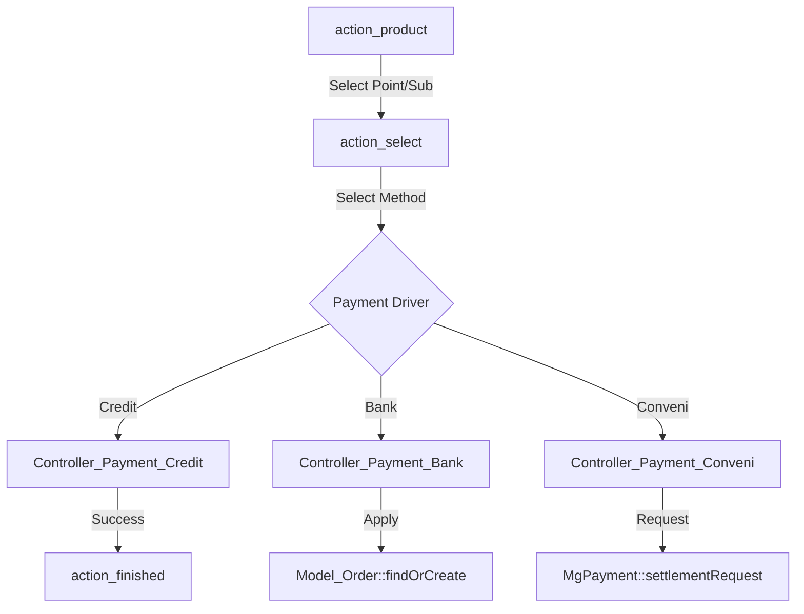

# Payment & Subscriptions

# Payment & Subscriptions Module

The Payment & Subscriptions module handles point purchases, subscription management (Flat Rate Packs), and Premium Pack upgrades. It integrates with multiple payment gateways (Credit Card, Bank Transfer, Convenience Store, Amazon Pay) and manages the logic for point consumption and member status transitions.

## Core Components

### Controllers
- `Controller_Payment`: The primary entry point. Handles product selection (points vs. subscriptions), price calculations, and initial routing for all payment types.
- `Controller_Payment_Base`: Provides shared utility methods for all payment drivers, including security token generation (`_createCreditToken`) and member status validation.
- `Controller_Payment_Credit`: Manages credit card flows, including "Quick Charge" (one-click payment for returning users) via the BIGSUN gateway.
- `Controller_Payment_Bank`: Handles manual bank transfer applications and order tracking.
- `Controller_Payment_Conveni`: Manages convenience store payment flows (Direct and Download types), requiring user contact information.

### Models
- `Model_Product`: Defines available items. Products are categorized by `type` (Point, Flat Rate Pack, Premium) and `payment` method.
- `Model_Order`: Tracks the lifecycle of a payment request, specifically for asynchronous methods like Bank and Convenience stores. Statuses include `REQUEST`, `PROCESSED`, `CANCEL`, `WAIT`, and `FINISH`.
- `Model_Point`: Defines the cost of actions (e.g., sending a message, viewing a profile) based on member status and gender.
- `Model_PointRate`: Manages the conversion logic from currency (Yen) to Points, including bonus point calculations for first-time vs. repeat buyers.

## Payment Execution Flow

The module follows a standardized flow from selection to completion:

### 1. Product Selection (`action_product`)
Determines if the user is eligible for the requested product.
- Checks `isPaymentOfPointAvailable()` or `isPaymentOfSubscriptionAvailable()`.
- Redirects users already subscribed to a "Joining" info page if they attempt to re-purchase an active subscription.

### 2. Price & Status Validation (`checkPriceAndMemberStatus`)
Located in the base controller, this method ensures:
- The product exists and is set to `DISPLAY_SHOW`.
- The member's current `SubscriptionOrderStatus` allows for a new purchase (prevents overlapping subscriptions unless within the renewal window).
- Users currently on Credit/AmazonPay subscriptions cannot switch to manual methods (Bank/Conveni) mid-cycle.

### 3. Credit Card & Quick Charge
The system supports "Quick Charge" for users with saved payment info:
- **First Time**: Redirects to the BIGSUN external payment site.
- **Subsequent**: Calls `MgPayment::forge('credit')->quickCharge()`.
- **Transaction Handling**: Uses dual-database transactions (`mgpf` and `default`) to ensure point addition and payment logging are atomic.

## Point Logic & Consumption

Point consumption is handled by the `Point` utility class, which abstracts the complexity of member ranks and campaign rates.

### `Point::usePointputMile`
This is the primary method for deducting points when a user performs an action.
1. **First Attack (FA) Logic**: Checks `Model_FirstAttackLog`. If it's the user's first interaction with a specific target, it may apply a different point rate (`pt_fa`).
2. **Coupling/Recent View**: For profile views, it checks if users are "coupled" or have viewed the profile within 24 hours to allow free access.
3. **Transaction Safety**: Wraps the deduction in a DB transaction and updates `last_use_date` in `Model_MemberPayment`.

### Point Conversion (`Model_PointRate::convertPrice2Point`)
Converts Yen to Points using a tiered rate system:
- Supports gender-specific rates.
- Supports "First Purchase" bonuses (`man_f_point` vs `man_point`).
- Iterates through `point_rates` table to calculate total points if the purchase spans multiple rate tiers.

## Subscription Lifecycle

Subscriptions (Flat Rate and Premium) modify the `members.status` and `member_payments` table.

- **Auto-Renewal**: For Credit/AmazonPay, `auto_update_flat_rate_pack` is set to `1`.
- **Manual Renewal**: For Bank/Conveni, a `Model_Order` is created with status `REQUEST`. The subscription is only extended once an admin or callback marks the order as `PROCESSED`.
- **Overlap Prevention**: `Model_Order::changeToFinishOfSameType` is called during new purchases to invalidate pending orders of the same type, preventing double-billing.

## Security & Tokens
- **Credit Tokens**: `_setGeneratedCreditToken` creates a one-time token (`ct`) to prevent CSRF and double-submission during the payment redirect flow.
- **Amazon Pay Tokens**: `_setApToken` and `_getApToken` manage session-based state for Amazon Pay redirects.
- **Signatures**: `Controller_Api::getSignature` is globally set in `before()` to authorize subsequent API calls from the payment views.