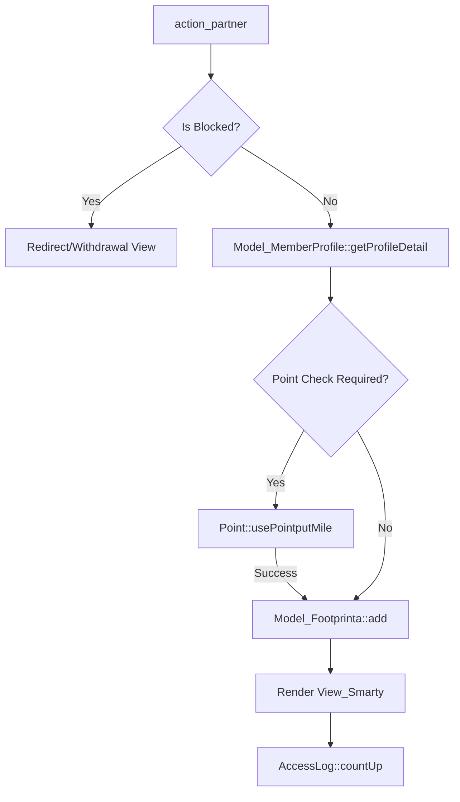

# Profile & Search — fuel

# Profile & Search — Fuel Module

The **Profile & Search** module is a core component of the application responsible for managing user identity, profile customization, and the discovery of other members. It handles the logic for profile editing, detailed profile viewing (including "Secret" and "Deep" profiles), and various search modalities (Main Search, Easy Search, and Aocca mode).

## Module Overview

The module is divided into three primary controllers:
1.  `Controller_Profile_Edit`: Manages the authenticated user's own data, including basic info, hobbies, and photo uploads.
2.  `Controller_Profile_Detail`: Handles the rendering of profile pages for both the user and potential partners, including point-based access control for premium content.
3.  `Controller_Profile_Search`: Implements the discovery engine, including "Easy Search" (keyword/category based) and the main recommendation list.

## Core Components & Logic

### 1. Profile Management (`Controller_Profile_Edit`)
This controller manages the lifecycle of user-provided data. It distinguishes between "Basic" data (stored in the main member tables) and "Profile" data (stored via `Model_MemberProfile`).

*   **Validation Logic**: The `action_birthday` method implements strict age verification, ensuring users are at least 18 years old and not currently high school students based on the Japanese school year (April 1st cutoff).
*   **Profile Completion**: Most update actions (e.g., `action_free_time`, `action_hobby`) trigger `Model_MemberProfile::chkProfilePercent`. This calculates the profile completion rate and may award "Bonus Points" to the user.
*   **Photo Upload**: `action_photo_upload` handles multi-part image uploads. It generates three thumbnail sizes, calculates MD5 hashes for file integrity, and resets "Photo Request" flags upon successful upload.

### 2. Discovery & Search (`Controller_Profile_Search`)
The search system provides multiple ways to find partners, heavily utilizing caching to maintain performance.

*   **Anti-Reload Mechanism**: `action_index` implements a rate-limiting check. If a user refreshes the search list too frequently (defined by `RELOAD_WAIT_TIME` and `reload_limit_cnt`), a dialog is triggered to prevent scraping or server strain.
*   **Easy Search (`action_easy`)**: A specialized search mode that displays two sets of "Simple Search" results. It prioritizes admin-configured settings (`Model_SimpleSearchSetting`) but falls back to random active categories if no specific settings are defined.
*   **Aocca Mode**: Integrates real-time "Aocca" (instant meet-up) status into the search results, filtering for users who have active "Aocca" purposes.

### 3. Profile Interaction (`Controller_Profile_Detail`)
This controller manages the viewing experience and the "Point Economy" associated with profile access.

*   **Access Control & Points**: Viewing a partner's profile often requires consuming points. The module checks `Point::getPointTable` to determine costs.
    *   **Prof Under (Secret Profile)**: Specialized personal info.
    *   **Prof Deep (Deep Profile)**: Highly specific compatibility data.
*   **Footprints**: Unless blocked or specifically disabled, visiting a profile automatically triggers `Model_Footprinta::add`, notifying the partner of the visit.
*   **Privacy & Blocks**: The module strictly checks the `blocks` table. If a user is blocked by the partner, they are redirected or shown a "Withdrawal" state to maintain privacy.

## Data Access Flow

The following diagram illustrates the execution flow when a user views a partner's profile:

## Key Function References

| Function | Location | Purpose |
| :--- | :--- | :--- |
| `_setProf` | `Controller_Profile_Edit` | Internal helper to save profile data and handle transactions/bonus points. |
| `action_partner` | `Controller_Profile_Detail` | Main entry point for viewing another user; handles point deduction and footprinting. |
| `action_easy` | `Controller_Profile_Search` | Logic for the "Easy Search" dashboard with randomized/configured categories. |
| `chkProfilePercent` | `Model_MemberProfile` | Calculates how much of a profile is filled; used for gamification/point rewards. |
| `awsPhotoGetCommon` | `Controller_Photo` | Utility used by Detail controllers to fetch signed URLs for profile/sub photos. |

## Implementation Details

### Point Consumption Logic
Point consumption is handled within `action_partner`, `action_secret`, and `action_deep`. The system uses a "Double Check" pattern:
1.  Check if the user has already paid for this specific partner's data (`Point::checkSecretProfPaid`).
2.  If not, verify current point balance against the `point_table`.
3.  Execute `Point::usePointputMile` within a DB transaction.
4.  Log the transaction in `Model_ProcessLog`.

### Personality Integration
The module integrates a "Personality" sub-system. If the `ITEM_PERSONALITY` extend switch is ON, `action_partner` and `action_myself` will fetch radar chart data via `Model_PersonalityLog::getPersonalityLog`. This data is used to display compatibility and "Favorite Tags" on the profile.

### Search Caching
To reduce DB load, `action_index` in the Search controller manages a `default_search_cached_limit`. Search results are cached for a set number of minutes (defined in `Model_Search::DEFAULT_SEARCH_CACHED_LIMIT`). The cache is only invalidated if the timer expires or the user changes their search criteria.