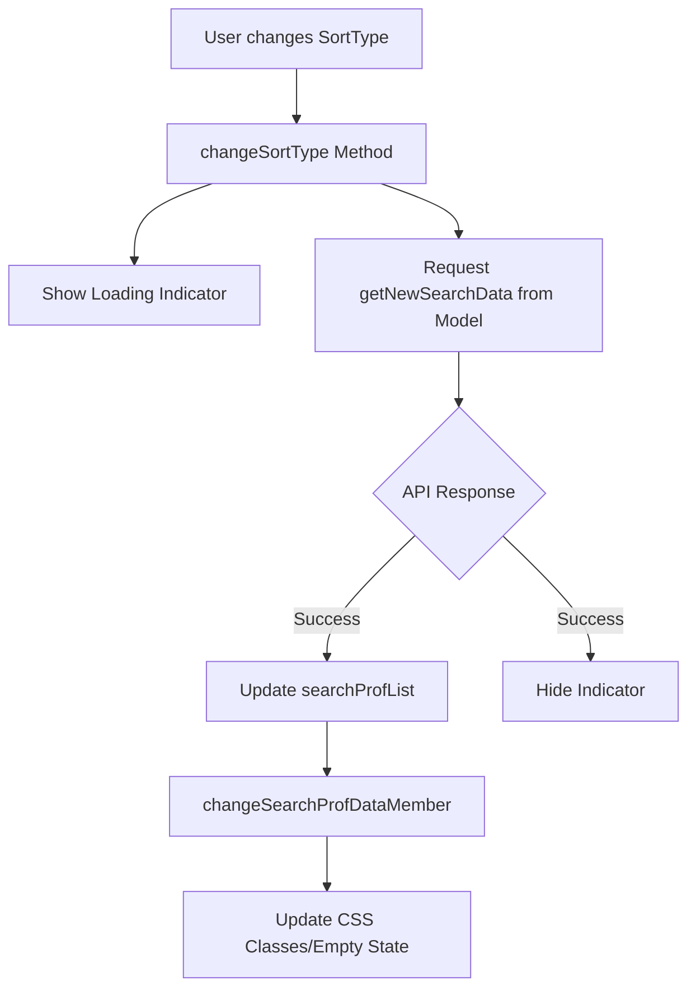

# Profile & Search — resources

# Profile & Search — Resources Module

This module manages the core user-facing functionality for searching member profiles and managing the authenticated user's own profile data. It is built using Vue.js (2.x) and TypeScript, acting as the orchestration layer between the UI components, local data models, and the backend API.

## Module Overview

The module is divided into two primary functional areas:
1.  **Search View Management (`SearchProfViewModel`)**: Handles the search results list, filtering, sorting, and a complex sequence of onboarding/promotional dialogs.
2.  **Profile Editing (`ProfileEdit`)**: Manages the user's own profile information, including asynchronous photo uploads, real-time field validation, and profile completion tracking.

---

## Search & Discovery (`SearchProfViewModel`)

The `SearchProfViewModel` extends `SearchBaseViewModel` to provide a specialized view for browsing member profiles. It coordinates several sub-components and manages the lifecycle of various "interrupt" dialogs (promotions, bonuses, and tutorials).

### Key Responsibilities
-   **Component Orchestration**: Initializes `SearchProfList` for the result grid and `SearchHeader` for navigation and sorting.
-   **State Management**: Tracks search parameters and updates the UI when data is empty or filtered.
-   **Dialog Sequencing**: Implements a chain of modals that appear upon login or registration (Intro 1 → Intro 2 → Intro 3 → Pickup Explain → Free Trial → Point Campaign → Login Bonus).
-   **Aocca Integration**: Manages the "Aocca" (matching/status) feature, including start/stop toasts and pause state dialogs.

### Search Execution Flow
When a user changes the sort order (e.g., from "Login Order" to "Recommended"), the following flow occurs:

### Critical Methods
-   **`changeSortType(value)`**: Triggers a fresh API call via the model and resets the list view state.
-   **`showAoccaStartMessage()`**: Determines if the user should see a first-time tutorial or a standard start toast based on `jsObject` data.
-   **`setWebNoticeFlgOffById()`**: An asynchronous utility that notifies the server when a specific banner or notice has been acknowledged.

---

## Profile Management (`ProfileEdit`)

The `ProfileEdit` class handles the logic for the `/profile/edit/top` page. It uses a hybrid approach, combining standard jQuery event listeners for form inputs with Vue instances for complex image management.

### Photo Management
The module supports two types of photos:
1.  **Profile Photo**: The primary user image.
2.  **Sub Photos**: Additional appeal images.

**Upload Process:**
1.  `onFileChange` captures the file and triggers `checkFile` (validating extension and size).
2.  `showPhotoPreviewDialog` (from `CommonDialog`) is called for user confirmation.
3.  `fileUpload` sends a `FormData` request to `/profile/edit/photo_upload`.
4.  Upon success, it triggers a completion dialog and redirects the user.

### Real-time Profile Updates
Instead of a single "Save" button, the module performs incremental saves as the user interacts with the form:
-   **Dropdowns/Selects**: Trigger `setMemberProf` or `setPrefCode` on change.
-   **Checkboxes (Purpose/Holidays)**: Use custom jQuery logic to handle "Unset" logic (e.g., checking "Unset" clears all other specific options).
-   **Bonus Tracking**: If an update completes a profile section, `BonusPtAddToast` displays the earned points returned by the API.

### Key Methods
-   **`setMemberProf(name, val)`**: Sends a POST request to `/apiv2/mem/set_member_prof.json`. Updates the "Profile Completion Percentage" bar in the UI dynamically.
-   **`fileDelete(setType, subNo)`**: Removes an image and updates the UI (either resetting to a silhouette or removing the DOM element) without a page reload.

---

## Integration with Global State

The module relies heavily on a global `jsObject` (declared in the PHP/Smarty templates). This object provides:
-   **Signatures**: Security tokens for API requests.
-   **Initial State**: Flags like `isAcceptedPrivacyPolicy`, `isRookie`, and `accessTime`.
-   **User Agent Info**: Used to apply iOS-specific fixes, such as `bgFixStart()` to prevent background scrolling when modals are open.

## Error Handling
Both sub-modules utilize a centralized `ErrorDialog` class. API failures (non-200 status codes or `success` flags not equal to `Consts.API_SUCCESS_OK`) are passed to `errorDialog.showError(code)`, which maps internal error codes to user-friendly messages.