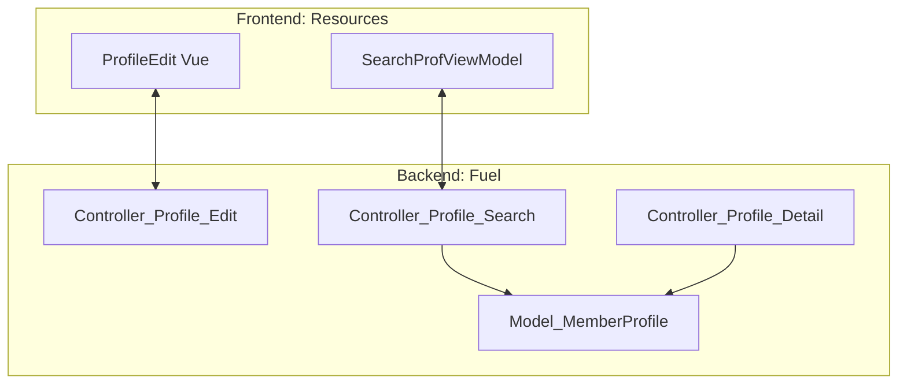

# Profile & Search

# Profile & Search Module

The **Profile & Search** module is a comprehensive system responsible for user identity management and member discovery. It bridges backend business logic (FuelPHP) with a reactive frontend (Vue.js/TypeScript) to facilitate profile customization, complex search filtering, and premium content access.

## Module Architecture

The module operates through a tight integration between server-side controllers and client-side view models:

*   **[Profile & Search — Fuel](fuel.md)**: Acts as the backend engine. It manages data persistence, point-based access control for "Secret" and "Deep" profiles, and complex SQL query building for various search modes (Aocca, Easy Search, and Main Search).
*   **[Profile & Search — Resources](resources.md)**: Serves as the orchestration layer for the UI. It utilizes Vue.js and TypeScript to handle real-time profile validation, asynchronous photo uploads, and the state management of search result lists.

## Key Workflows

### Profile Management & Validation
The module facilitates a seamless transition from data entry to persistence. `ProfileEdit` in the Resources module handles real-time field validation and photo uploads via `fileUpload`. These requests are processed by `Controller_Profile_Edit`, which updates the core member data and tracks profile completion percentages.

### Discovery and Search Modalities
The system supports multiple discovery paths managed by `Controller_Profile_Search` and rendered via `SearchProfViewModel`:
*   **Main Search**: Standard filtering and sorting.
*   **Easy Search**: Simplified discovery using `getActivedSimpleSearchData`.
*   **Aocca Mode**: A specialized search mode utilizing specific sorting logic.
*   **Pickup**: Curated member discovery via `_makePickup`.

### Access Control and Premium Content
The `Controller_Profile_Detail` manages the logic for viewing profiles. It distinguishes between standard profile data and restricted content (Secret/Deep profiles). Access to these areas often triggers point-based transactions or specific session checks (e.g., `action_secret` or `action_myself`) to ensure the authenticated user has the necessary permissions to view the requested data.

### Data Formatting and Normalization
To ensure consistency across the UI, the module uses centralized formatting methods. `Model_MemberProfile` and `Model_ProfileData` handle the conversion of raw database values into display-ready strings, such as converting newlines for text areas or formatting area data for "Haunt" locations.