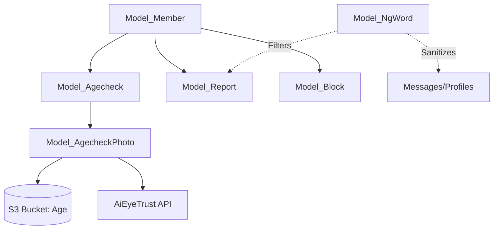

# Safety & Verification

# Safety & Verification Module

The Safety & Verification module is a critical security layer responsible for user age validation, content moderation via NG-word filtering, and interpersonal safety through blocking and reporting mechanisms.

## 1. Age Verification System

This sub-module handles the submission and administrative review of identification documents to verify that users meet age requirements.

### User-Facing Flow (`Controller_AgeVerification`)
Users upload identification documents (Driver's License, Health Insurance, etc.) which are processed and stored in S3.

*   **Document Types**: Defined by constants like `DETAIL_NAME_DRIVER`, `DETAIL_NAME_PASSPORT`, etc.
*   **Image Processing**: 
    *   `action_file_upload`: Handles AJAX uploads. It performs image reduction (`_reductionImage`), orientation correction (`Common::changeOrientation`), and generates a unique hash to detect duplicate submissions.
    *   **S3 Storage**: Files are moved to an S3 bucket defined by `Consts::S3BUCKET_AGE`.
    *   **Thickness Verification**: For high-risk documents (Driver's License, My Number Card), the system requires an "edge" (thickness) photo to prevent the use of printed paper copies.
*   **Manual Redaction**: `action_brush` allows users to "paint over" sensitive information on their ID before final submission.

### Administrative Review (`Model_Agecheck`)
The `setAgecheck` function is the core logic for the admin review interface.

*   **Status Transitions**: Updates `members.age_check` based on the review result.
*   **Automated Rewards**: Upon successful verification, `Model_BonusPoint::getAgeCheckPt` is called to grant service points to the user.
*   **NG Notifications**: If a document is rejected, the system automatically sends a specific email (e.g., `MAIL_AGE_CHECK_NG_EXCLUDED_CERTIFICATE`) and logs the reason in the member's internal notes.

### AI Integration (`Controller_Aieyetrust_Agecheck`)
The system integrates with "AiEyeTrust" for automated thickness/authenticity checks.
*   **Callback**: `post_result` receives JSON payloads from the external AI service and updates `aieyetrust_result` in the `age_check_photos` table.
*   **Security**: `isAllowIP` restricts callback access to authorized IP ranges defined in the configuration.

---

## 2. Content Moderation (NG-Word System)

`Model_NgWord` provides a robust filtering engine used across the platform (Profiles, Messages, Tweets, etc.).

### Filter Types
| Type | Constant | Action |
| :--- | :--- | :--- |
| **Forbidden** | `TYPE_NG_WORD` | Blocks submission or triggers validation error. |
| **Guard** | `TYPE_GUARD` | Replaces text with asterisks (`*`). |
| **Extract** | `TYPE_EXTRACT` | Highlights text in admin view for manual review. |
| **Auto-Report** | `TYPE_REPORT` | Silently flags the content for administrative attention. |

### Core Logic: Normalization
To prevent users from bypassing filters using full-width/half-width variations or different Kana types, the module uses `_convertNgWordCheckStr`:
1.  Converts small characters to large (ァ -> ア).
2.  Converts all Kana to half-width to normalize voiced sound marks (濁点).
3.  Converts back to full-width for a standardized comparison string.

### Key Methods
*   **`setGuardWordReplaceAsterisk`**: Used in `InMsg` and `Tag` classes to sanitize output.
*   **`setNgWordColoring`**: Used in admin panels to highlight violations. It uses a complex position-tracking algorithm (`getNgWordPositionInText`) to ensure nested tags (e.g., a Guard word inside an Extract word) do not break HTML structure.
*   **`ngWordValidation`**: Returns a boolean and the specific matched words for use in FuelPHP Validation objects.

---

## 3. User Safety (Blocking & Reporting)

### Reporting (`Model_Report`)
Allows users to flag inappropriate content.
*   **Context Aware**: Reports are linked to specific "places" (Profile, Message, Tweet, etc.) via `Model_NgWord` constants.
*   **Process Logging**: Every report creates a `Model_ProcessLog` entry to maintain an audit trail for administrators.

### Blocking (`Model_Block`)
Handles user-level restrictions.
*   **`add` / `release`**: Manages the relationship between `from_members_id` and `to_members_id`.
*   **Caching**: `doCachingLimitData` is used to optimize performance when generating member lists, ensuring blocked users are excluded from search results and visibility.
*   **Limits**: `isLimited` checks if a user has exceeded the maximum number of allowed blocks (defined in `Consts::LIMIT_HIDE_BLOCK_MEMBER`).

---

## 4. Data Architecture



## 5. Developer Integration Patterns

### Adding a New NG-Word Check
When validating a new input field, use the helper pattern:
```php
$val = Validation::forge();
$val->add_field('content', 'Content', 'required')
    ->add_rule('ng_word_validation', Model_NgWord::CONTENT_MESSAGE);
```

### Checking Age Verification Status
Always check the `age_check` property on the Member object:
```php
if ($member->age_check != Model_Member::AGE_CHECK_PHOTO) {
    Response::redirect('ageverification/index');
}
```

### Handling Image Uploads
When adding new verification document types, ensure the `_reductionImage` method is called to maintain storage efficiency and strip metadata before S3 upload.