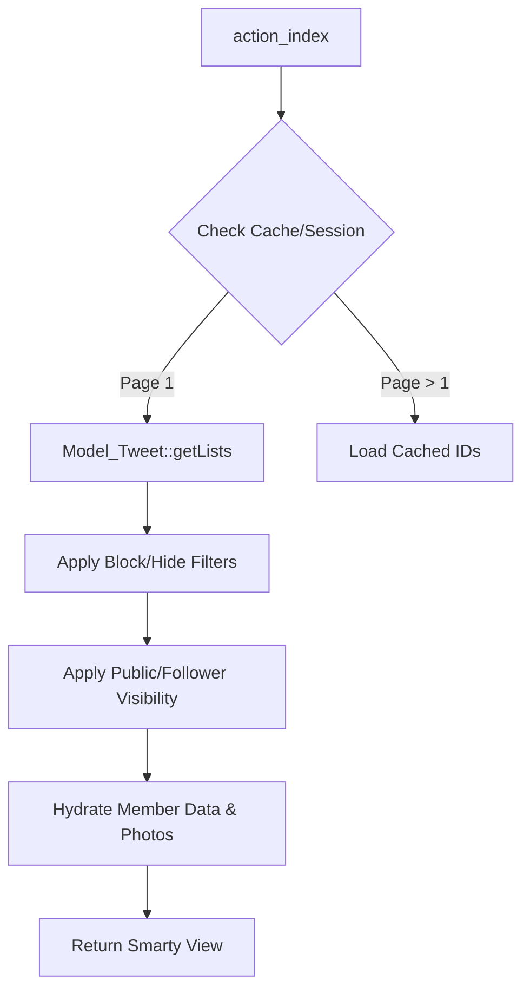

# Social Features (Aocca & Community)

# Social Features (Aocca & Community) Module

The Social Features module manages the core engagement mechanics of the platform, including user-generated communities, real-time status updates (Tweets), and the "Aocca" (real-time meeting) system. It facilitates user discovery through shared interests and temporal availability.

## Module Overview

The module is divided into three primary functional areas:
1.  **Communities**: Interest-based groups where users can join, create, and discover others with similar hobbies or traits.
2.  **Tweets**: A micro-blogging feature allowing users to post text and photos, share content, and interact via "Nices" (likes).
3.  **Aocca**: A specialized real-time status system that signals a user's immediate availability for interaction, often with a specific purpose.

---

## 1. Community Management

The community system is handled by `Controller_Community` and `Model_Community`. It supports both official (admin-created) and user-created groups.

### Key Functionalities
*   **Discovery**: Communities are categorized by type: `TYPE_OFFICIAL`, `TYPE_USERS`, `TYPE_HOT`, and `TYPE_NEW_ARRIVAL`.
*   **Creation**: Users can create communities via `action_create`. This involves a multi-step process: category selection, photo upload, and validation against unique names.
*   **Membership**: Handled via `Model_JoinCommunity`. The `action_detail` view displays members within a community, filtered by the current user's preferences.
*   **Same Community Discovery**: `Model_Community::getSameCommunity` identifies potential matches who have recently joined the same groups as the authenticated user.

### Community Types (`Model_Community` Constants)
| Constant | Description |
| :--- | :--- |
| `TYPE_OFFICIAL` | Groups created by administrators. |
| `TYPE_USERS` | Groups created by the user base. |
| `TYPE_HOT` | Groups with high recent activity (shuffled for variety). |
| `TYPE_MEMBER` | Groups the current user has joined. |

---

## 2. Tweet System

The Tweet system (`Controller_Tweet`) provides a social feed. It includes complex logic for visibility, filtering, and content sharing.

### Execution Flow: Feed Generation
The `action_index` method generates the main feed using `Model_Tweet::getLists`.

### Content Security & Moderation
*   **NG Words**: Content is passed through `Model_NgWord::setGuardWordReplaceAsterisk` to mask prohibited terms.
*   **Admin Checks**: Tweets have a `check` status (`CHECK_NONE`, `CHECK_OK`, `CHECK_NG`). Content marked as `CHECK_NG` is excluded from queries via `_getNotExistQuery`.
*   **Visibility Logic**: Tweets respect complex visibility rules (`public_general`, `public_follow`, `public_follower`).

---

## 3. Aocca (Real-time Status)

Aocca is an API-driven feature (`Controller_Apiv2_Aocca`) that manages short-term availability states.

### Core API Endpoints
*   **`post_start`**: Initiates an Aocca session. It validates if the user is already in a session or under a restriction (`is_dorman`). It also triggers `Mail::MAIL_AOCCA_NOTICE` to relevant followers.
*   **`post_stop`**: Manually terminates the session and logs the action in `Model_ProcessLog`.
*   **`post_get_aocca`**: Returns the current session's `start_time`, `end_time`, and `limit_time` (cooldown).

### Purpose System
Users select an `aocca_purpose_id` (e.g., "Looking for lunch," "Want to chat"). These are retrieved via `Model_AoccaPurpose::getAoccaPurposeList` based on the user's gender.

---

## 4. Technical Implementation Details

### Photo Handling
Both Communities and Tweets utilize a shared upload pattern:
1.  **Temporary Upload**: Files are uploaded to a temporary directory via `Model_Community::fileUpload` or `Common::fileUpload`.
2.  **Processing**: Images are resized into three thumbnails (`thumbnail1`, `thumbnail2`, `thumbnail3`).
3.  **Persistence**: Paths are stored in the `photos` table. Tweet photos are specifically linked via `photos_id` in the `tweets` table.
4.  **CDN Integration**: Image URLs are generated using `Config::get('site.url.cdndomain')` and often involve `MyEncrypt::encrypt` for security.

### Pagination & Caching
To maintain performance across large datasets, the module uses a "Page ID Caching" strategy:
*   **Initial Load**: The system queries for a large set of IDs matching the criteria and stores them in a temporary file/session (`Common::saveTempfile`).
*   **Subsequent Pages**: Instead of re-running complex JOINs, the system slices the cached ID list and hydrates only the required records for the current page.
*   **Reload Detection**: Uses `HTTP_CACHE_CONTROL` to determine if the cache should be bypassed.

### Security & Signatures
API interactions (especially in Aocca) require a signature check via `Controller_Api::signatureCheck()`. This ensures that requests are authenticated and have not been tampered with during transit.

### Database Patterns
*   **Replica Usage**: Heavy read operations (like `getCommunityTopDatas`) explicitly use `execute('replica')` to offload the primary database.
*   **Soft Deletes**: Most models implement `deleted_at` checks within their query builders to ensure data integrity.