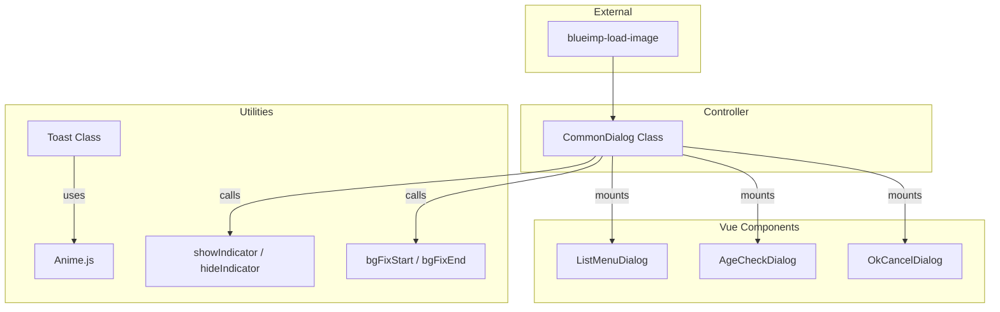

# UI Components & Dialogs

# UI Components & Dialogs Module

The UI Components & Dialogs module provides a standardized framework for displaying modal overlays, user notifications (toasts), and loading indicators across the application. It leverages Vue.js for component structure and Anime.js for animations, while providing a non-Vue `CommonDialog` wrapper for legacy or global script integration.

## Core Functionality

### Background Scrolling Management
To prevent "background scroll" when a modal is active, the module provides two utility functions:
- `bgFixStart()`: Captures the current scroll position and applies a `bg_fix` CSS class to the body.
- `bgFixEnd()`: Removes the fix and restores the user's previous scroll position.

### Loading Indicators
The module manages global loading states via `showIndicator()` and `hideIndicator()`. These functions inject a spinner into the DOM (either `.cp-container` or `.fl-container`) and optionally trigger the background fix.

---

## Vue Components

The module defines several reusable Vue components located in `resources/assets/js/components/`.

### `OkCancelDialog.ts`
A standard confirmation modal with two buttons.
- **Slots**: `header`, `body`, `cancelBtn`, `okBtn`, `footer`.
- **Events**: 
  - `@click`: Emitted when the OK button is pressed.
  - `@close`: Emitted when either button is pressed.

### `AgeCheckDialog.ts`
A specialized modal for age verification gates.
- **Props**: 
  - `page_title`: The name of the restricted page.
  - `pointpresent`: Points awarded upon verification.
- **Action**: Redirects the user to `/ageverification/index`.

### `NiceDialog.ts`
Used for social interactions (e.g., "Nice" or "Like" actions).
- **Slots**: `photoPartner` (for user avatars), `body`, `niceItemList`.

---

## The CommonDialog Class

The `CommonDialog` class in `dialog.ts` acts as a singleton-style controller that initializes and manages multiple Vue instances tied to specific DOM elements (e.g., `#ngword_dialog`, `#photo_edit_dialog`).

### Usage Pattern
To use a common dialog, instantiate the class and call the relevant `show` method:

```typescript
import { CommonDialog } from "./dialog";
const dialogs = new CommonDialog();

// Show a specific dialog
dialogs.showNgwordDialog();
```

### Key Methods
| Method | Purpose |
|:---|:---|
| `showPhotoPreviewDialog(file, callback)` | Uses `blueimp-load-image` to parse metadata and display a local image preview before upload. |
| `showListHeaderMenuDialog(...)` | Displays a context menu for list views (Delete, Release, Withdraw). It automatically clears specific `sessionStorage` keys related to list pagination when actions are taken. |
| `showProfCompDialog(pt)` | Displays a specialized "100% Profile Completion" celebration modal. |
| `showAoccaLimitDialog()` | Displays a restriction notice for the "Aocca" feature. |

---

## Toast Notifications

The `Toast` class provides transient, non-blocking feedback messages. Unlike the Dialog components, Toasts are generated dynamically in the DOM and self-destruct after their animation completes.

### `Toast.show(text, scrollFlag)`
- **Animation**: Uses Anime.js to fade in (300ms), pause (1500ms), and fade out (300ms).
- **Interaction Blocking**: If `scrollFlag` is true, the class attaches event listeners to `touchmove`, `DOMMouseScroll`, and specific key codes (Space, Arrows) to prevent user interaction while the toast is visible.

---

## Architecture Diagram

The following diagram illustrates how the `CommonDialog` controller orchestrates various Vue components and interacts with the browser environment.



## Implementation Details

### List Menu Session Clearing
The `showListHeaderMenuDialog` is tightly coupled with the application's caching strategy. When a user performs an action (like withdrawing or deleting) via this dialog, the module clears `sessionStorage` for:
- `footprint_list`
- `message_list`
- `nice_list`
- `favorite_list`
- `block_list`
- And several others to ensure the UI reflects the updated state upon the next navigation.

### Image Preview Logic
The `photoPreviewDialog` within `CommonDialog` handles complex client-side image processing:
1. Calls `LoadImage.parseMetaData` to handle EXIF data.
2. Renders the image to a Canvas.
3. Converts the canvas to a DataURL with `0.5` quality (specifically to support Android Firefox compatibility).
4. Displays the preview and executes the provided `callback` only if the user confirms.